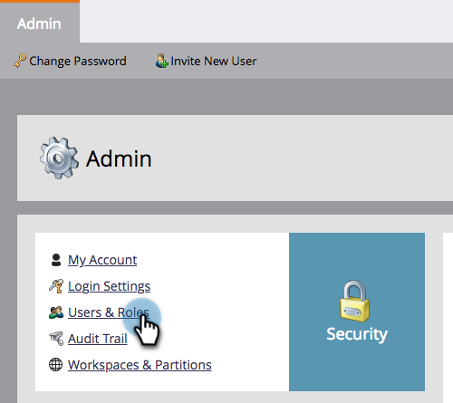

# Expiração de ativo local {#local-asset-expiration}

Defina uma data/hora de expiração para desfazer a publicação de landing pages, desativar campanhas de acionador ou parar campanhas em lote recorrentes.

## Conceder permissão de expiração de ativo agendado {#grant-schedule-asset-expiration-permission}

Antes de programar uma expiração de ativo, a função Marketo deve ter a permissão correta ativada.

>[!NOTE]
>
>**Permissões de administrador necessárias**

1. No [!UICONTROL Administrador] , clique em **[!UICONTROL Usuários e funções]**.

   

1. Clique no botão **[!UICONTROL Funções]** , selecione o usuário ao qual deseja conceder acesso e clique em **[!UICONTROL Editar função]**.

   

1. Em [!UICONTROL Acessar atividades de marketing], selecione **[!UICONTROL Programar Expiração de Ativo Local]** e clique em **[!UICONTROL Salvar]**.

   

## Definir uma data de expiração {#set-an-expiration-date}

1. Clique com o botão direito do mouse no programa desejado e selecione **[!UICONTROL Definir expiração de ativo local]**.

   

1. Verifique os ativos para os quais deseja definir uma data de expiração e clique em **[!UICONTROL Definir expiração]**.

   

1. Escolha uma data de expiração.

   

1. Defina um horário. Você deve agendar um horário de pelo menos 20 minutos no futuro (não se esqueça de entrar no AM/PM). Clique em **[!UICONTROL Confirmar]** quando concluído.

   

>[!NOTE]
>
>* Para editar uma data de expiração existente, basta verificar o(s) ativo(s) e clicar em **[!UICONTROL Definir expiração]**.
>* Depois que um ativo expirar, ele não será mais exibido na grade de expiração. A grade só exibirá páginas de aterrissagem publicadas, campanhas de acionador ativas e campanhas em lote recorrentes.
>* As expirações programadas serão removidas se o ativo for movido para outro programa.

## Remover uma data de expiração {#remove-an-expiration-date}

1. Para remover uma data de expiração, verifique o(s) ativo(s) e clique em **[!UICONTROL Remover Expiração]**.

   

1. Revise os ativos que estão sendo afetados e clique em **[!UICONTROL Confirmar]**.

   

>[!NOTE]
>
>Não é possível remover datas de expiração inferiores a 15 minutos no futuro. Para &quot;remover&quot; a expiração, será necessário aguardar a expiração do ativo e, em seguida, aprová-lo novamente ou reativá-lo.
