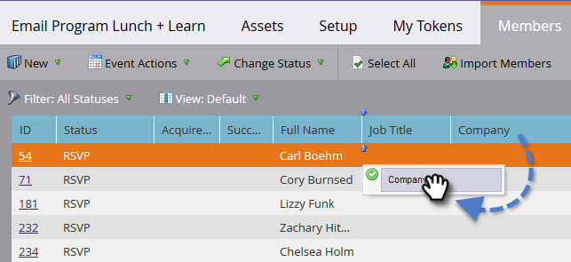

# Gerenciar e Visualização membros {#manage-and-view-members}

Você pode gerenciar e visualização seus membros em seus programas usando a guia Membros.

>[!NOTE]
>
>**Mergulho profundo**
>
> Mergulhe mais fundo em [associação ao programa](../../../../product-docs/core-marketo-concepts/programs/creating-programs/understanding-program-membership.md).

## Procurar um Membro {#search-for-a-member}

Na parte inferior da seção Membros, use o campo de pesquisa para procurar membros do programa por nome, email, cargo ou empresa.

1. Clique na guia **Members** do seu programa.

   

1. Use o campo de pesquisa para pesquisar a lista dos membros.

   

## Exportar a Grade de Membros {#export-the-members-grid}

É possível exportar a lista de membro clicando no ícone do Excel ao lado do campo de pesquisa.

## Gerenciar colunas na grade de membros {#manage-columns-in-the-members-grid}

* Arraste e solte colunas para alterar sua ordem. O par de setas azuis indica para onde a coluna irá.

   

* Clique com o botão direito do mouse no cabeçalho da coluna para classificar alfabeticamente, ascendente ou descendente.

   

## Escolha quais colunas estão visíveis na grade {#choose-which-columns-are-visible-in-the-grid}

1. Clique na lista suspensa **Visualização **e selecione **Criar Visualização**.

   

1. Dê um nome à sua visualização personalizada. Selecione os títulos das colunas. Clique em** Adicionar **e** Remover **para mover colunas e criar uma visualização.

   

1. Clique em **Criar**.

   

## Filtrar a Grade de Membros {#filter-the-members-grid}

1. Clique no menu suspenso **Filter** e selecione uma etapa de progressão para classificar.

   

## Gerenciar o status da pessoa na grade de membros {#manage-person-status-in-the-members-grid}

Você pode alterar o status de suas pessoas dentro da grade de membros.

1. Mantenha pressionada a tecla **Ctrl/Cmd** e selecione as pessoas.

   

1. Clique no menu suspenso **Alterar status** e selecione um status.

   

   Isso pode levar um momento. Você verá a mensagem abaixo quando tudo estiver pronto!

   

Tantas características, mas são todas muito simples. Aproveite!

>[!MORELIKETHIS]
>
>* [Criar um relatório de desempenho de Programa](../../../../product-docs/core-marketo-concepts/programs/program-performance-report/create-a-program-performance-report.md)

>

