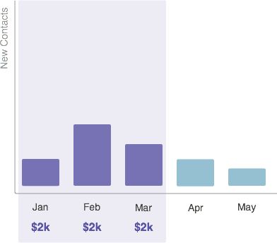

# Noções básicas sobre custos do período {#understanding-period-costs}

## Visão geral {#overview}

Custos de período referem-se ao dinheiro gasto em um mês específico em um programa.

>[!NOTE]
>
>**Exemplo**
>
>Se você gastar US$ 1.000 para contratar um ilustrador para uma [!DNL eBook] que será lançada em julho - o programa [!DNL eBook] terá um custo de período de US$ 1.000 em julho.
>
>Se você gastar US$ 200 por mês em [!DNL Google Adwords] - o programa [!DNL Google Adwords] terá um custo do período de US$ 200 _todo mês_.

>[!NOTE]
>
>[Noções básicas sobre programas](/help/marketo/product-docs/core-marketo-concepts/programs/creating-programs/understanding-programs.md)
>
>[Noções básicas sobre a associação ao programa](/help/marketo/product-docs/core-marketo-concepts/programs/creating-programs/understanding-program-membership.md)

## Como os Custos do Período são Calculados {#how-period-costs-are-calculated}

Imagine um evento, como um webinário, que ocorre em março. Novas pessoas são adquiridas com antecedência da publicidade em janeiro e fevereiro. Novos contatos também são adquiridos após o evento, quando as pessoas baixam o webinário nos meses de abril e maio.

1. Com um único custo de período atribuído a março...

   

   ...contatos adicionados nos meses anteriores e posteriores _somente_ contarão até março.

   

1. Com os custos do período atribuídos a janeiro, fevereiro e março...

   

   ...contatos adicionados somente nos meses seguintes a março contarão até março.

   

1. Com os custos do período atribuídos a janeiro e abril...

   

   ...contatos adicionados nos meses de janeiro a março contarão em janeiro. Contatos adicionados nos meses de abril e maio contarão em abril.

   

   >[!NOTE]
   >
   >Em resumo - os meses sem custos de período definidos serão transferidos &quot;para trás&quot; até o último que foi definido. Se não houver custo do período anterior, os meses serão transferidos &quot;para a frente&quot; até o próximo que foi definido. Se um custo de período não tiver sido definido para _qualquer_ meses, os relatórios no RCE não estarão disponíveis para o programa.

   >[!MORELIKETHIS]
   >
   >* [Usando Custos do Período em um Programa](/help/marketo/product-docs/core-marketo-concepts/programs/working-with-programs/using-period-costs-in-a-program.md)
   >* [Filtrar um Relatório de Programa por Custo do Período](/help/marketo/product-docs/core-marketo-concepts/programs/program-performance-report/filter-a-program-report-by-period-cost.md)
