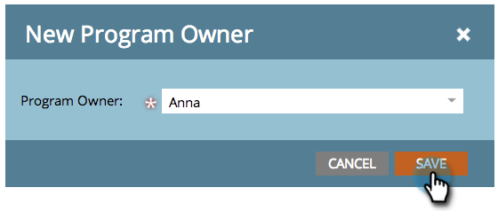

# Usar tags em um Programa {#use-tags-in-a-program}

Tags são atributos que descrevem seus programas e são usados para agrupar tipos de programas no relatórios.

## Usar uma tag em um Programa {#use-a-tag-in-a-program}

1. Selecione seu programa. Clique em **Configuração**.

   

1. Arraste e solte uma tag na tela de desenho.

   

1. Selecione um valor no menu suspenso.

   

1. Clique em **Salvar**.

   

1. Certo. Você verá a nova tag na tela.

   

## Editar uma tag {#edit-a-tag}

1. Vá para a guia **Setup**. Clique com o botão direito do mouse na tag . Selecione **Editar**.

   

1. Clique na lista suspensa. Selecione um novo valor.

   

1. Clique em **Salvar**.

   

1. Ótimo! Você deve ver as edições refletidas na tela.

   

## Excluir uma tag {#delete-a-tag}

1. Vá para a guia **Setup**. Clique com o botão direito do mouse na tag e selecione **Excluir**.

   

1. Clique em **Excluir **para confirmar.

   

Alto cinco! Acabou. Programas com tags consistentes facilitam a execução de relatórios.
