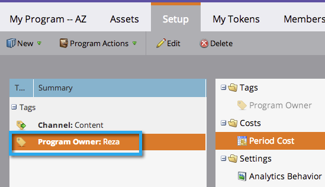

# Usar tags em um programa {#use-tags-in-a-program}

Tags são atributos que descrevem seus programas e são usadas para agrupar tipos de programas nos relatórios.

>[!NOTE]
>
>Se você usar o Explorador de ciclo de receita, um custo de período deverá ser definido (mesmo se for 0) para que o relatório fique disponível para o programa.

## Usar uma tag em um programa {#use-a-tag-in-a-program}

1. Selecione seu programa. Clique em **Configuração**.

   

1. Arraste e solte uma tag na tela de desenho.

   

1. Selecione um valor no menu suspenso.

   

1. Clique em **Salvar**.

   

1. Diretamente. Você verá a nova tag na tela.

   

## Editar uma tag {#edit-a-tag}

1. Vá para a **Configuração** guia. Clique com o botão direito do mouse na tag. Selecionar **Editar**.

   

1. Clique na lista suspensa. Selecione um novo valor.

   

1. Clique em **Salvar**.

   

1. Ótimo! Você deve ver as edições refletidas na tela.

   

## Excluir uma tag  {#delete-a-tag}

1. Vá para a **Configuração** guia. Clique com o botão direito na tag e selecione **Excluir**.

   

1. Clique em **Excluir** para confirmar.

   

Bom trabalho! Programas com tags consistentes facilitam muito a execução de relatórios.
