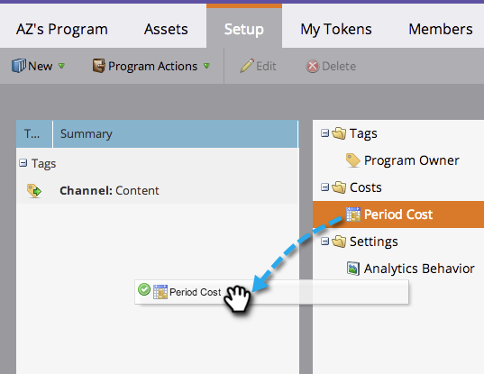
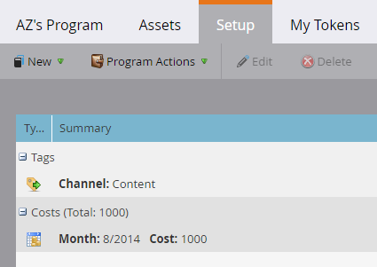

# Uso dos custos do período em um Programa {#using-period-costs-in-a-program}

O custo [de um](understanding-period-costs.md) período é a quantia que você gasta em um programa. Pode ser por um ou mais meses e é usado para o ROI do relatórios.

>[!NOTE]
>
>**Mergulho profundo**
>
> Saiba mais sobre o [Revenue Cycle Analytics](http://docs.marketo.com/display/docs/revenue+cycle+analytics).

## Adicionar um Custo de Período  {#add-a-period-cost}

1. Vá até a guia **Configuração** do seu programa.

   

1. Arraste e solte o Custo **do** Período na tela.

   

1. Clique no ícone de calendário. Selecione um mês. Clique em **OK**.

   

1. Informe um Custo **do** Período (sem decimais ou vírgulas). Clique em **Salvar**.

   >[!NOTE]
   >
   >Isto pode ser uma estimativa. Você sempre pode editar um custo de período depois de saber a quantia exata (consulte a próxima seção).

   

1. O custo é exibido no programa.

   

   >[!TIP]
   >
   >Você pode arrastar e soltar vários custos do período na tela. Isso permite que você atribua vários meses com diferentes custos do período ao seu programa.

## Editar um Custo de Período {#edit-a-period-cost}

1. Se você gastar mais ou menos dinheiro do que o inicialmente projetado, poderá editar o custo do período.
1. Vá para a **guia Configuração **do seu programa.

   

1. Clique com o botão direito do mouse em Custo do **Período**. Selecione **Editar**.

   

1. Faça suas edições. Clique em **Salvar**.

   

## Excluir um Custo de Período {#delete-a-period-cost}

1. Vá até a guia **Configuração** do seu programa.

   

1. Clique com o botão direito do mouse em Custo do **Período**. Selecione **Excluir**.

   

1. Clique em **Excluir **para confirmar.

   

>[!MORELIKETHIS]
>
>* [Noções básicas sobre os custos do período](understanding-period-costs.md)
>* [Análise do ciclo de receita](http://docs.marketo.com/display/docs/revenue+cycle+analytics)
>* [Filtrar um Relatório de Programa por Custo de Período](../../../../product-docs/core-marketo-concepts/programs/program-performance-report/filter-a-program-report-by-period-cost.md)

>

