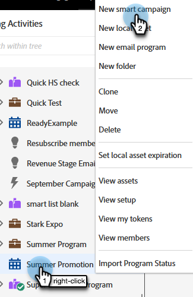

# Criar uma nova campanha inteligente {#create-a-new-smart-campaign}

As Campanhas inteligentes são a ferramenta mais importante no Marketo Engage. Eles podem acionar uma pessoa e executar ações ou totalizar milhões de pessoas e executar uma série de etapas de fluxo.

>[!TIP]
>
>Saiba mais sobre [Campanhas inteligentes](/help/marketo/product-docs/core-marketo-concepts/smart-campaigns/understanding-smart-campaigns.md){target="_blank"}.

1. Vá para **[!UICONTROL Atividades de marketing]**.

   

1. Clique com o botão direito no programa desejado e selecione **[!UICONTROL Nova Campanha Inteligente]**.

   

   >[!TIP]
   >
   >Você pode criar Campanhas inteligentes como ativos locais de qualquer programa.

1. Insira o nome da Campanha inteligente e clique em **[!UICONTROL Criar]**.

   

   Em seguida, saiba como definir quais pessoas devem executar a Campanha inteligente com uma lista inteligente.

   >[!MORELIKETHIS]
   >
   >* [Definir lista inteligente para campanha inteligente | Lote](/help/marketo/product-docs/core-marketo-concepts/smart-campaigns/creating-a-smart-campaign/define-smart-list-for-smart-campaign-batch.md){target="_blank"}
   >* [Definir lista inteligente para campanha inteligente | Acionador](/help/marketo/product-docs/core-marketo-concepts/smart-campaigns/creating-a-smart-campaign/define-smart-list-for-smart-campaign-trigger.md){target="_blank"}
