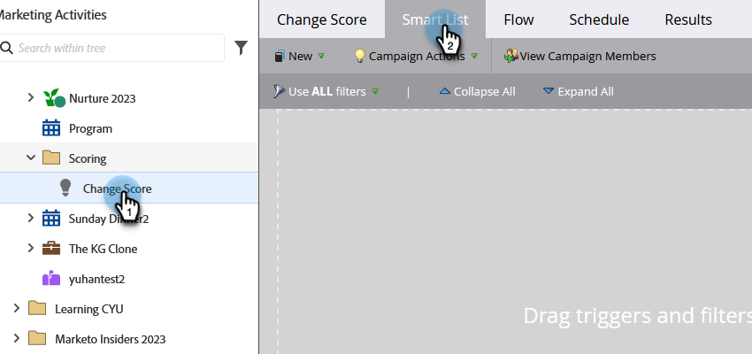

# Definir lista inteligente para o Smart Campaign | Lote {#define-smart-list-for-smart-campaign-batch}

As Smart Lists são o mecanismo usado no Marketo Engage para definir &quot;quem&quot; (quais pessoas) incluir, seja um relatório, uma lista ou uma Campanha inteligente. Veja como definir uma Smart List para uma campanha em lote.

>[!CAUTION]
>
>Fazer edições de Smart List ou Etapa de fluxo em uma campanha ativa pode quebrar sua funcionalidade. Se você optar por fazer isso, continue com cuidado.

1. Escolha uma Campanha inteligente e clique em **[!UICONTROL Lista inteligente]**.

   

1. Digite para procurar um filtro, arraste-o e solte-o na tela de desenho. Repita o processo para vários filtros.

   

   >[!NOTE]
   >
   >Uma campanha inteligente com apenas filtros é executada no _Lote_ modo. Ele encontra pessoas no banco de dados que se qualificam com base nos filtros e executa todas elas pelo fluxo de uma vez.

   >[!NOTE]
   >
   >Você pode fazer com que uma Campanha inteligente seja executada em uma pessoa de cada vez com base em eventos ao vivo adicionando acionadores, o que coloca a Campanha inteligente no estado _Acionador_ modo.

1. Clique na lista suspensa e escolha um operador de filtro para o filtro escolhido.

   

   >[!CAUTION]
   >
   >Linhas vermelhas sinuosas indicam erros ou informações ausentes. Se não for corrigida, a campanha será inválida e não será executada.

1. Insira o valor do filtro.

   

   >[!NOTE]
   >
   >Por padrão, as pessoas que atendem a TODAS as regras da Smart List são qualificadas. Isso pode ser modificado para atender às suas necessidades de campanha. Confira  [Regras da lista inteligente para lógica complexa](/help/marketo/product-docs/core-marketo-concepts/smart-lists-and-static-lists/using-smart-lists/using-advanced-smart-list-rule-logic.md){target="_blank"} para saber mais.

   Para acionar em eventos ao vivo uma pessoa por vez, saiba como [Definir lista inteligente para o Smart Campaign | Acionador](/help/marketo/product-docs/core-marketo-concepts/smart-campaigns/creating-a-smart-campaign/define-smart-list-for-smart-campaign-trigger.md){target="_blank"}.

   >[!MORELIKETHIS]
   >
   >* [Definir lista inteligente para o Smart Campaign | Acionador](/help/marketo/product-docs/core-marketo-concepts/smart-campaigns/creating-a-smart-campaign/define-smart-list-for-smart-campaign-trigger.md){target="_blank"}
   >* [Adicionar uma etapa de fluxo a uma campanha inteligente](/help/marketo/product-docs/core-marketo-concepts/smart-campaigns/flow-actions/add-a-flow-step-to-a-smart-campaign.md){target="_blank"}
