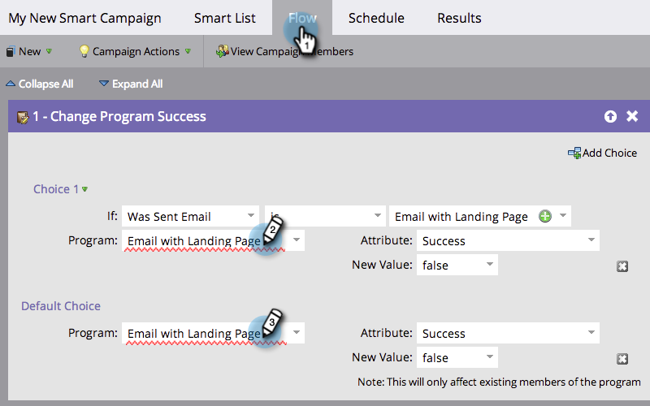

# Lista de verificação do Smart Campaign {#smart-campaign-checklist}

Siga as etapas abaixo para garantir a execução perfeita da Campanha inteligente e evitar erros o máximo possível.

## Livrar-se dos erros da lista inteligente {#get-rid-of-smart-list-errors}

Em sua Campanha inteligente, clique em **[!UICONTROL Lista inteligente]**. Livre-se de linhas vermelhas sinuosas que você vê corrigindo os erros.

>[!TIP]
>
>Linhas vermelhas sinuosas indicam erros ou informações ausentes. Se não for corrigida, a campanha será inválida e não será executada.
>
>Além disso, mantenha as coisas simples. Se você tem dezenas ou centenas de filtros, é difícil mantê-los e rastreá-los. Menos filtros também são mais rápidos de carregar.

>[!NOTE]
>
>O uso de **[!UICONTROL Membro da Smart List]** pode ter erros nessa outra lista. Verifique lá também.

## Livrar-se de erros de fluxo {#get-rid-of-flow-errors}

Em sua Campanha inteligente, clique em **[!UICONTROL Fluxo]**. Livre-se de linhas vermelhas sinuosas vistas corrigindo os erros.

>[!TIP]
>
>Passe o mouse sobre a linha vermelha rajada para ver detalhes do erro.

## Revise a Guia Programação {#review-the-schedule-tab}

Na guia **[!UICONTROL Agendamento]**, verifique o **[!UICONTROL Status da Smart List]** para ver se há erros na Campanha Inteligente que precisem ser corrigidos.

## Verificar Limite de Restrições de Pessoa {#check-person-restrictions-limit}

Na guia **[!UICONTROL Agendar]**, verifique se o número de pessoas qualificadas não excede o limite de restrição de pessoas.

>[!TIP]
>
>Se necessário, você pode [substituir restrições de pessoa em uma Campanha Inteligente](/help/marketo/product-docs/core-marketo-concepts/smart-campaigns/using-smart-campaigns/override-person-restrictions-in-a-smart-campaign.md).

>[!NOTE]
>
>**Lembrete**
>
>Se a Campanha inteligente ainda falhar, saiba como [entender as notificações](/help/marketo/product-docs/core-marketo-concepts/miscellaneous/understanding-notifications.md) para descobrir o que aconteceu e como corrigi-lo.

Excelente trabalho! Mantenha essa lista de verificação acessível antes de executar uma Campanha inteligente.
