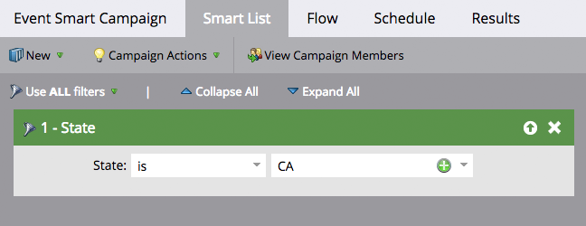
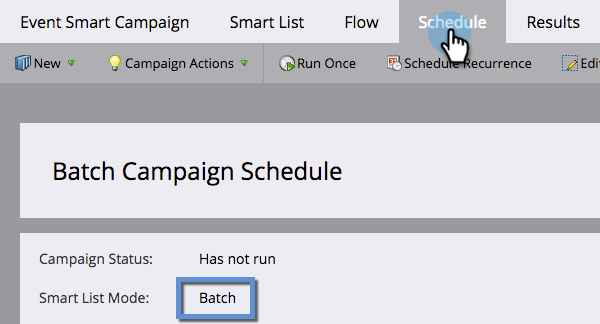
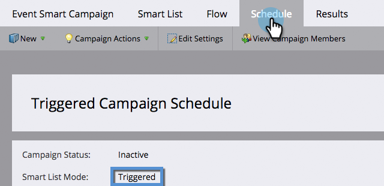

# Noções básicas sobre campanhas inteligentes em lote e acionáveis {#understanding-batch-and-trigger-smart-campaigns}

Há dois tipos de campanhas inteligentes: Em lote e Acionador.

## Campanha em lote {#batch-campaign}

>[!NOTE]
>
>**Definição**
>
>Uma Campanha em lote é iniciada em um horário específico e afeta um conjunto específico de pessoas, todas de uma só vez. Um exemplo seria o envio de um email para todas as pessoas na Califórnia.

As campanhas em lote só terão filtros na seção de lista inteligente (ou seja, nenhum acionador).

Clicar na guia **[!UICONTROL Agendamento]** confirmará que a Campanha inteligente está definida como &quot;Em lote&quot;.

**Campanhas inteligentes em lote**

* Pode ser programado para recorrências, como diariamente, semanalmente e mensalmente. Você também pode executá-las apenas uma vez.
* Estão visíveis na [exibição de agendamento de programa](/help/marketo/product-docs/core-marketo-concepts/programs/program-schedule-view/navigating-the-program-schedule-view.md){target="_blank"}. Qualquer item depois de uma etapa &quot;Aguardar&quot; na Campanha inteligente não será incluído na visualização.

  

## Campanha com acionador {#trigger-campaign}

>[!NOTE]
>
>**Definição**
>
>Uma Campanha de acionador afeta uma pessoa de cada vez com base em um evento acionado. Um exemplo de um acionador seria clicar em um link em um email.

Se uma Campanha inteligente usar pelo menos um acionador na seção Smart List, o modo será automaticamente definido como acionado.

Clicar na guia **[!UICONTROL Agendamento]** confirmará que a Campanha inteligente está definida como &quot;Acionado&quot;.

**Acionar Campanhas**

* Não é possível agendar recorrências. Elas só podem ser definidas como ativas ou inativas.
* É possível definir mais de um acionador. No entanto, se algum acionador for acionado, as ações da campanha serão executadas.

>[!TIP]
>
>Use o [log de atividades](/help/marketo/product-docs/core-marketo-concepts/smart-lists-and-static-lists/managing-people-in-smart-lists/locate-the-activity-log-for-a-person.md){target="_blank"} para ver o que ocorreu passo a passo em suas Campanhas Inteligentes. Você pode encontrar o log de atividades na última guia da página de detalhes de uma pessoa.
