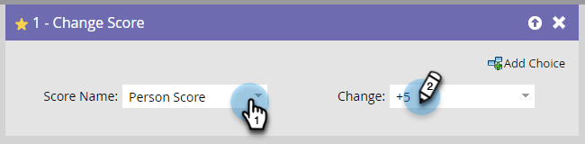

# Adicionar uma etapa de fluxo a uma campanha inteligente {#add-a-flow-step-to-a-smart-campaign}

Etapas de fluxo informam ao Marketo Engage o que você deseja que aconteça com um grupo de pessoas que se qualificam.

1. Ir para **[!UICONTROL Atividades de marketing]**.

   

1. Selecione a Campanha inteligente e clique em **[!UICONTROL Fluxo]**.

   

1. Digite para procurar uma etapa de fluxo, em seguida, arraste e solte-a na tela. Você pode adicionar várias etapas de fluxo - repita isso com cada etapa que deseja que a campanha execute.

   

1. Clique na opção e no valor desejados.

   

>[!NOTE]
>
>As etapas de fluxo são executadas na ordem em que são listadas. [Reordenar as etapas do fluxo](/help/marketo/product-docs/core-marketo-concepts/smart-campaigns/flow-actions/reorder-the-flow-steps-in-a-smart-campaign.md){target="_blank"} para garantir que estejam na sequência correta.

>[!TIP]
>
>Uma linha vermelha rajada é exibida no caso de uma entrada inválida. Passe o mouse sobre a linha para ver como corrigi-la.

Ótimo! Certifique-se de [revisar e validar a Campanha inteligente](/help/marketo/product-docs/core-marketo-concepts/smart-campaigns/creating-a-smart-campaign/smart-campaign-checklist.md){target="_blank"} antes de agendar ou ativar.

>[!MORELIKETHIS]
>
>* [Usar Adicionar escolha em uma etapa de fluxo](/help/marketo/product-docs/core-marketo-concepts/smart-campaigns/flow-actions/use-add-choice-in-a-flow-step.md){target="_blank"}
>* [Reordenar as etapas de fluxo em uma campanha inteligente](/help/marketo/product-docs/core-marketo-concepts/smart-campaigns/flow-actions/reorder-the-flow-steps-in-a-smart-campaign.md){target="_blank"}
