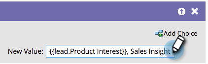

# Anexar dados a um campo {#append-data-to-a-field}

Há uma maneira fácil de anexar dados a um campo. Veja como.

>[!PREREQUISITES]
>
>[Criar uma campanha](/help/marketo/product-docs/core-marketo-concepts/smart-campaigns/creating-a-smart-campaign/create-a-new-smart-campaign.md){target="_blank"}

>[!NOTE]
>
>As etapas abaixo também se aplicam a [Alterar dados dos membros do programa](/help/marketo/product-docs/core-marketo-concepts/smart-campaigns/program-flow-actions/change-program-member-data.md){target="_blank"}.

1. No **[!UICONTROL Fluxo]** arraste na guia **[!UICONTROL Alterar valor dos dados]** etapa do fluxo.

   

1. Localize e selecione o campo ao qual deseja anexar dados.

   

1. Localize e selecione o token para o mesmo campo ao qual deseja anexar dados.

   

1. Agora adicione o valor que deseja anexar ao que já existe no campo.

   

Pronto! Você pode ser criativo e adicionar vários tokens nele.
