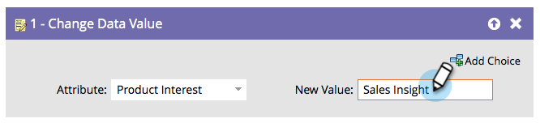

# Alterar valor dos dados {#change-data-value}

Você pode usar o Marketo para atualizar o valor de um campo. Para isso, você usará a ação de fluxo **[!UICONTROL Alterar Valor de Dados]**.

>[!NOTE]
>
>Também é possível bloquear a atualização de um campo. Consulte [Bloquear atualizações de um campo](/help/marketo/product-docs/administration/field-management/block-updates-to-a-field.md){target="_blank"} para obter detalhes.

1. Localize e selecione o campo do qual deseja alterar o valor.

   

1. Insira o valor desejado e pronto!

   

   >[!NOTE]
   >
   >Você também pode usar tokens em **[!UICONTROL Novo valor]**.

   >[!TIP]
   >
   >Você pode inserir &#39;NULL&#39; (sem aspas, todas em maiúsculas) em **[!UICONTROL Novo valor]** para limpar o campo. Consulte [Limpar Valores do Campo](/help/marketo/product-docs/core-marketo-concepts/smart-campaigns/flow-actions/clear-field-values.md){target="_blank"} para obter detalhes.

   >[!NOTE]
   >
   >* [Tokens para Etapas de Fluxo](/help/marketo/product-docs/core-marketo-concepts/smart-campaigns/flow-actions/use-tokens-in-flow-steps.md){target="_blank"}
   >* [Anexar Dados a um Campo](/help/marketo/product-docs/core-marketo-concepts/smart-campaigns/flow-actions/append-data-to-a-field.md){target="_blank"}
