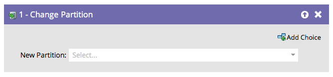

# Alterar partição de pessoas {#change-person-partition}

Se você estiver usando [espaços de trabalho e partições](/help/marketo/product-docs/administration/workspaces-and-person-partitions/understanding-workspaces-and-person-partitions.md){target="_blank"}, será necessário criar campanhas inteligentes para mover pessoas de uma partição para outra.

1. Selecione a Partição para a qual deseja mover as pessoas.

É fácil assim!
