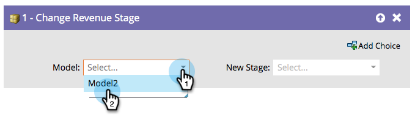

# Alterar estágio de receita {#change-revenue-stage}

## Visão geral {#overview}

Se você estiver usando o Modelador de ciclo de receita e tiver um modelo aprovado, poderá decidir mover pessoas manualmente de um estágio para outro. Esta etapa de fluxo ajudará.

## Uso {#usage}

1. Selecione o **[!UICONTROL Modelo]**.

   

1. Selecione o **[!UICONTROL Novo estágio]** você deseja atribuir e está pronto!

   

   >[!CAUTION]
   >
   >O data warehouse presta muita atenção a quando as pessoas se movem entre estágios. Isso pode criar dados incorretos se usados incorretamente.
