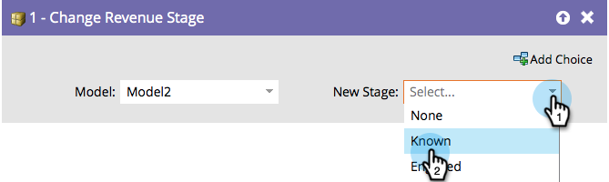

# Alterar estágio de receita {#change-revenue-stage}

Se estiver usando o Revenue Cycle Modeler e tiver um modelo aprovado, você pode decidir mover pessoas manualmente de um estágio para outro. Esta etapa de fluxo ajudará.

1. Selecione o **[!UICONTROL Modelo]**.

   

1. Selecione o **[!UICONTROL Novo Estágio]** que você deseja atribuir e pronto!

   

   >[!CAUTION]
   >
   >O data warehouse presta muita atenção a quando as pessoas se movem entre estágios. Isso pode criar dados incorretos se usados incorretamente.
