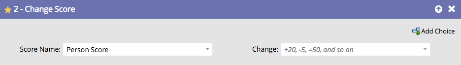

# Alterar pontuação {#change-score}

Marcar pessoas é fácil e eficiente e ajuda sua equipe de vendas a priorizar.

1. Escolha o campo de pontuação que deseja alterar.

   

   >[!TIP]
   >
   >Você pode criar vários campos de pontuação. Consulte [Criar um campo personalizado no Marketo](/help/marketo/product-docs/administration/field-management/create-a-custom-field-in-marketo.md){target="_blank"} para obter detalhes.

1. Insira a alteração de pontuação desejada.

   

   Alterações:

   * **+5** para incrementar
   * **-5** diminuirá (números negativos permitidos)
   * **=5** fará com que a pontuação seja o número exato
   * **=-5** fará com que a pontuação seja exatamente o número negativo

Obtenha uma pontuação básica rapidamente e ajuste os resultados ao longo do tempo.
