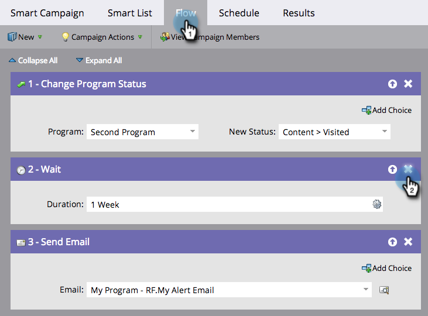
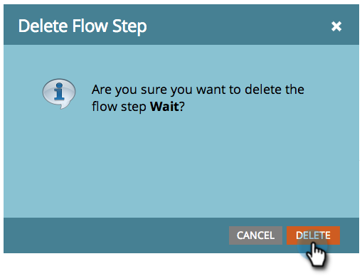

# Excluir uma etapa do fluxo {#delete-a-flow-step}

>[!CAUTION]
>
>A remoção de etapas de fluxo, _especialmente etapas de espera_ de Campanhas Inteligentes ativas, pode ter resultados inesperados. Leia este artigo cuidadosamente.

Para remover uma etapa de fluxo indesejada de uma Campanha inteligente:

1. No **[!UICONTROL Fluxo]** do Smart Campaign, clique no ícone **X** para excluir qualquer etapa do fluxo.

   

1. Clique em **[!UICONTROL Excluir]**.

   

   >[!CAUTION]
   >
   >Excluir, adicionar e mover etapas dentro de uma campanha _ativa_ pode definitivamente ter resultados inesperados. Considere criar uma nova campanha, testá-la e depois alternar.

   As alterações podem ser feitas em uma campanha ativa, mas podem ter consequências imprevistas. Veja os detalhes:

   **Campanhas inteligentes em lote**

   Se sua campanha:

   1. **Nunca executado**. Faça todas as alterações desejadas. Não afetará ninguém até você dirigir essa campanha.
   1. **É uma campanha inteligente recorrente**. As alterações afetarão as pessoas nas execuções futuras, não nas execuções anteriores.
   1. **Já executado SEM etapas de espera**.Nenhuma pessoa será afetada porque a campanha está inativa após a execução.
   1. **Está em execução neste momento**. As alterações podem causar comportamento inesperado, dependendo do tempo e dos detalhes da exclusão. Recomendamos NÃO editar uma campanha em lote que esteja em execução ativamente. Para casos de emergência, saiba como [suspender uma Campanha Inteligente em execução](/help/marketo/product-docs/core-marketo-concepts/smart-campaigns/using-smart-campaigns/abort-a-smart-campaign.md){target="_blank"}.

   1. **Já executado COM etapas de espera.** Vários detalhes sobre este.
Quando uma pessoa insere uma etapa de espera, ela anota a duração e a QUAL ETAPA NUMÉRICA retornar. Veja o exemplo abaixo.

   **Acionar Campanhas Inteligentes**

   1. **Nenhuma etapa de espera**. Se você excluir uma etapa normal, somente as pessoas que executarão a campanha no futuro serão afetadas.
   1. **Com etapas de espera**. Consulte o exemplo abaixo para campanhas em lote. A mesma lógica se aplica.

   >[!NOTE]
   >
   >**Exemplo**
   >
   >1. Uma campanha inteligente tem 3 etapas.
   >    * ETAPA 1. Enviar e-mail #1
   >    * ETAPA 2. Aguardar 1 semana
   >    * ETAPA 3. Enviar e-mail #2
   >
   >1. As pessoas que atingirem **Etapa 2** aguardarão 1 semana antes de passar para a **Etapa 3**.
   >1. Você exclui a **Etapa 2** durante a semana.
   >1. As pessoas continuarão a aguardar a 1 semana (elas não voltam automaticamente ao fluxo).
   >1. Ao retornarem, eles tentarão ir para a **Etapa 3**. Eles não vão encontrá-lo.
   >1. **IMPORTANTE:** como agora há apenas 2 etapas, as pessoas _não receberão o email #2_.
