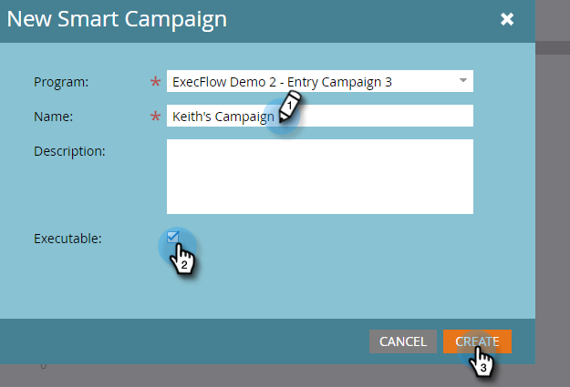

# Executar campanha {#execute-campaign}

Uma campanha executável, como outras campanhas, contém uma Smart List, um Fluxo e um Agendamento. Diferentemente de outras campanhas, você não as agenda ou ativa. Ele só pode ser chamado por outra campanha através da etapa Executar fluxo de campanha. As etapas de fluxo na Campanha executável são executadas em série com a campanha principal (ao contrário da Campanha de solicitação, que é executada em paralelo em uma Campanha de acionador separada).

>[!NOTE]
>
>As campanhas executáveis são sempre filhos da campanha (principal) que as chama.

## Quando usar Executar campanha {#when-to-use-execute-campaign}

Há muitas coisas que você pode fazer com uma campanha executável. Foram projetadas para facilitar tarefas operacionais comuns, como roteamento de clientes potenciais, gerenciamento de ciclo de vida e pontuação (entre outras), e podem ser usadas para executar o mesmo fluxo de trabalho a partir de Campanhas em lote ou acionadas.

Você também pode usá-los quando precisar executar um fluxo separado, mas precisará depender dos resultados desse fluxo nas escolhas de etapas de fluxo subsequentes (ou seja, se isso acontecer, faça isso).

Executar o Campaign é uma melhoria em relação [Solicitar campanha](/help/marketo/product-docs/core-marketo-concepts/smart-campaigns/flow-actions/request-campaign.md), pois pode ser executado em série, enquanto o último só é executado em paralelo.

>[!NOTE]
>
>As Etapas de espera e os Webhooks nunca serão compatíveis com as Campanhas executáveis. Para isso, será necessário usar Solicitar campanha.

## Como criar uma campanha executável {#how-to-create-an-executable-campaign}

1. Clique com o botão direito do mouse no programa desejado e selecione **[!UICONTROL Nova campanha inteligente]**.

   

1. Dê um nome a ele, selecione a variável **[!UICONTROL Executável]** e clique em **[!UICONTROL Criar]**.

   

1. Defina a Smart List e o Fluxo como qualquer outra Campanha inteligente.

Também é possível clonar uma Campanha inteligente existente. Se você clonar uma Campanha Executável existente, ainda será necessário selecionar o **[!UICONTROL Executável]** depois de nomeá-la.

>[!NOTE]
>
>Não é possível clonar uma campanha que contém acionadores.

## Usar context de token da campanha matriz {#use-parent-campaign-token-context}

Quando definido como true, os seguintes contextos de token serão enviados para a campanha filho (aquela que está sendo executada):

* Meus tokens
* Tokens de campanha
* Tokens de programa
* Tokens de membros
* [Tokens de acionador](/help/marketo/product-docs/marketo-sales-insight/msi-for-salesforce/features/tabs-in-the-msi-panel/interesting-moments/trigger-tokens-for-interesting-moments.md) (se chamado de uma campanha acionada)

**Interação com a API**

Ao usar Programar ou Solicitar campanha [na API](https://developers.marketo.com/rest-api/assets/smart-campaigns/#batch), ambos permitem passar valores para Meus tokens, o que substitui os valores definidos para esses tokens na campanha que você está chamando. Se essa campanha executar outra campanha e definir &quot;Usar contexto pai como verdadeiro&quot;, ela usará os valores transmitidos pela API, em vez dos valores definidos no aplicativo.

## Itens a Observar {#things-to-note}

* A Smart List filtrará todos os que não se qualificarem. Se uma pessoa se qualificar, o registro de atividade de Campanha executada resultante a listará como &quot;Qualificado: TRUE&quot; (e FALSE se não)
* As regras de qualificação do Schedule Campaign se aplicam (Configurações do Smart Campaign na guia Schedule)
* Campanhas executáveis não podem ser chamadas entre espaços de trabalho
* Se você usar o [Remover do fluxo](/help/marketo/product-docs/core-marketo-concepts/smart-campaigns/flow-actions/remove-from-flow.md) ação de fluxo direcionada a uma Campanha executável, ela direcionará o filho e o pai
* Aproveitar a herança do token - por exemplo, se você tiver um único fluxo de pontuação comum acionado por vários ativos diferentes, poderá definir uma pontuação padrão Meu token na campanha filho e na campanha pai, para que possa substituir o valor da campanha de pontuação filho para suas campanhas pai (veja abaixo o exemplo visual)
* As campanhas executáveis podem ser chamadas para até três níveis de profundidade (por exemplo, Campanha principal > Filho > Filho > Filho)

>[!CAUTION]
>
>Nunca deixe suas smart lists para Campanhas Executáveis inválidas, caso contrário _ninguém_ se qualificará para ele. A prática recomendada é criar ativos de lista inteligente separados, defini-los completamente e garantir que sejam válidos. Em seguida, use o filtro &quot;Membro da Smart List&quot; na Campanha Executável para trocar a definição da sua smart list.

## Exemplo de herança do token {#token-inheritance-example}

Abaixo está um exemplo visual de Herança de tokens em uma Campanha Executável e duas campanhas pai: uma com contexto de token definido como **[!UICONTROL True]**, o outro para **[!UICONTROL Falso]**.

Campanha filho com uma Pontuação de alteração tokenizada.

A campanha infantil é Meus Tokens.

### Exemplo um - Verdadeiro {#example-one-true}

Na etapa Executar fluxo de campanha da primeira campanha principal, o &quot;Usar contexto do token de campanha principal&quot; está definido como **True**.

Meus tokens da campanha pai.

Os resultados: pontuação alterada em +10.

### Exemplo dois: falso {#example-two-false}

Na etapa Executar fluxo de campanha da segunda campanha principal, o &quot;Usar contexto do token de campanha principal&quot; está definido como **Falso**.

Meus tokens da campanha pai.

Os resultados: pontuação inalterada, pois o valor de pontuação da campanha filho, +0, foi usado.

