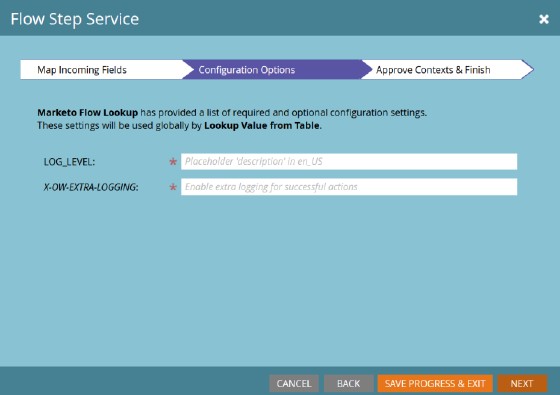

# Serviço de etapa de fluxo {#flow-step-service}

Etapas de fluxo de autoatendimento é uma estrutura e um conjunto de recursos para criação, publicação e integração de serviços da Web nas Campanhas inteligentes do Adobe Marketo Engage. Este guia destina-se aos usuários finais do Marketo Engage que desejam instalar e usar serviços que já foram criados e publicados. Para obter informações sobre como criar e publicar seu próprio serviço, consulte o [[!DNL GitHub] repositório da Interface do Provedor de Serviços](https://github.com/adobe/Marketo-SSFS-Service-Provider-Interface){target="_blank"}. Uma implementação de Tabela de Pesquisa de Prova de Conceito pode ser encontrada [aqui](https://github.com/adobe/mkto-flow-lookup){target="_blank"}.

## Serviços de integração e gerenciamento {#onboarding-and-managing-services}

A instalação de uma etapa de fluxo personalizada requer permissões de administrador no Marketo. Além do URL de instalação, todos os outros aspectos de um serviço podem ser editados após a conclusão da integração inicial, detalhando a tela de detalhes do serviço na grade Provedores de serviços.

## URL de instalação {#installation-url}

Para iniciar a instalação, primeiro obtenha o URL do documento OpenAPI que define seu serviço. Seu provedor de serviços poderá fornecer isso a você e geralmente terá uma URL terminando em `/openapi.json`. URLs completas serão parecidas com `https://www.example.com/OpenAPI.json`. Depois de obter esta URL, vá para o menu [!UICONTROL Provedores de Serviços] na Seção [!UICONTROL Administrador].

Clique em **[!UICONTROL Avançar]** para ir até a seção Inserir Credenciais de Serviço.

## Inserir credenciais de serviço {#enter-service-credentials}

Para acessar o serviço que está sendo instalado, o Marketo deve ter credenciais de API válidas. Essas credenciais devem ser fornecidas a você pelo seu provedor de serviços. Os serviços têm três opções de autenticação diferentes, portanto, você pode ver um dos três prompts diferentes de credenciais: **Chave de API**, que tem apenas um campo de entrada, **Autenticação Básica**, que requer um nome de usuário e senha, e também pode exigir um campo chamado Realm, e **OAuth2**, usando a concessão _Credenciais de Cliente_, que requer uma _ID de Cliente_ e _Segredo de Cliente_.

Quando você salvar suas credenciais, o Marketo tentará chamar o endpoint de status do serviço para verificar se elas são válidas. Se as credenciais fornecidas forem inválidas, você verá um erro indicando isso.

>[!CAUTION]
>
>Se um provedor de serviços for criado e excluído, você não poderá reutilizar seu nome de provedor de serviços, API, acionador ou filtro a partir de agora.

## Guia de integração (opcional) {#onboarding-guide}

Alguns provedores de serviços incluirão uma etapa opcional do Guia de integração. Esta etapa incluirá instruções adicionais para concluir a integração de serviço específicas para esse serviço.

## Mapeamento de campos {#field-mapping}

Para receber ou retornar dados de um campo de cliente potencial específico, esse campo deve ser mapeado. Embora o mapeamento seja uma etapa necessária durante a integração, você sempre pode retornar para alterar os mapeamentos posteriormente. Há dois tipos de mapeamentos configurados em telas separadas: **Campos de Saída**, que são enviados para o serviço quando o Marketo invoca a etapa de fluxo, e **Campos de Entrada**, que são campos que podem receber dados do serviço quando ele retorna dados para o Marketo.

>[!NOTE]
>
>Ao mapear um campo de saída, você dá à Marketo permissão para transmitir dados desse campo relacionados a clientes potenciais processados pelo serviço associado. Certifique-se de que você tenha a autoridade e a autoridade legal apropriadas para transmitir esses dados ao seu provedor de serviços, pois esses campos podem incluir Informações de identificação pessoal cobertas pelas leis de Privacidade de dados, Proteção e Arrendamento.

Os mapeamentos de campo opcionais podem ser desativados sem interromper o serviço, mas os mapeamentos necessários podem não ser removidos ou desativados completamente.

## Mapeamentos orientados por serviço {#service-driven-mappings}

Os serviços que têm um conjunto fixo de entradas e saídas, como uma etapa do fluxo de registro de eventos, usam **Mapeamentos Controlados por Serviços**. Para esse tipo de mapeamento, o provedor de serviços fornecerá um tipo de dados e uma dica na forma de um nome de API. Se a dica corresponder ao nome da API de um campo de cliente potencial existente, esse campo será preenchido automaticamente na seção de mapeamento. Para campos sem uma dica correspondente, será necessário preencher o mapeamento manualmente a partir da lista de campos com o tipo de dados correspondente. Os mapeamentos necessários devem ser preenchidos para concluir a integração.

## Mapeamentos orientados pelo usuário {#user-driven-mappings}

Os serviços que não têm um conjunto fixo de entradas e saídas, como um serviço de formatação de data, usam **Mapeamentos Orientados pelo Usuário**. Isso significa que cada campo de entrada e saída deve ser configurado por um Administrador.

## Campos de saída {#outgoing-fields}

Os campos de saída são aqueles enviados para o Serviço de etapa do fluxo quando essa etapa do fluxo é usada em uma campanha inteligente.

## Campos de entrada {#incoming-fields}

Os campos de entrada são aqueles nos quais o Serviço de etapa do fluxo tem permissão para gravar dados.

## Opções de configuração (opcional) {#configuration-options}

Alguns serviços têm opções de configuração global opcionais ou obrigatórias. Se alguma opção for necessária, um valor deverá ser definido para todas as opções necessárias antes de salvar ou concluir a integração. Os parâmetros cujos nomes estão em itálico são enviados para o serviço chamado como cabeçalhos.

## Retirando um Serviço {#retiring-a-service}

Para facilitar as transições para versões novas ou alternativas de um serviço, sem interromper o uso ativo, os serviços podem ser removidos do menu Provedores de serviços. **Retirar um Serviço** remove a etapa de fluxo correspondente da Paleta de Fluxo de Campanha Inteligente, para que nenhum uso novo possa ser criado. Na maioria dos casos, você deve ter um serviço de substituição pronto para substituir o existente ao optar por desativar um serviço.

## Descontinuação de serviço {#service-deprecation}

Às vezes, os provedores de serviços precisarão descontinuar os serviços de etapa de fluxo como parte normal do ciclo de vida do software. Quando um provedor de serviços anunciar isso, a Data de desativação e a Mensagem serão preenchidas na exibição de grade Provedores de serviços. Continuar a usar um serviço que foi descontinuado pode resultar na interrupção do serviço se ele não responder mais da maneira esperada ou parar de aceitar solicitações do Marketo Smart Campaigns, portanto, você deve prestar muita atenção a qualquer notificação de Descontinuação de serviço recebida e tomar as medidas apropriadas para desativar ou substituir qualquer etapa do serviço que ainda esteja em uso.

## Etapas de fluxo personalizadas e de terceiros {#using-third-party-and-custom-flow-steps}

Os degraus de fluxo instalados podem ser utilizados em grande medida da mesma forma que os degraus de fluxo padrão. Todos os parâmetros de fluxo definidos pelo serviço são apresentados aos usuários finais.

## Atualizando listas de opções {#refreshing-picklists}

O Marketo atualizará as opções de lista de opções de serviços todas as noites, mas há momentos em que você precisará de novas opções disponíveis, como a criação de campanhas. Você pode atualizá-las facilmente de qualquer instância da etapa do fluxo usando o botão de atualização ou acessando o menu [!UICONTROL Administrador] > [!UICONTROL Provedores de Serviços] e clicando em [!UICONTROL Atualizar Lista de Opções] depois de selecionar seu serviço.

## Verificação de campos de entrada {#checking-incoming-fields}

Você pode verificar quais campos de entrada são configurados para uma determinada etapa do fluxo, passando o mouse sobre o ícone de dica de ferramenta. Isso é útil para determinar quais campos podem mudar quando um lead flui por ele, de modo que você possa configurar as opções nas etapas subsequentes usando esses campos.

## Campos de entrada e alterações no valor de dados {#incoming-fields-and-data-value-changes}

Ao contrário da maioria das outras etapas de fluxo, as implementadas com a estrutura SSFS podem gravar dados nos campos de cliente potencial que são mapeados por um administrador e registrar essas alterações como atividades de Alteração do valor dos dados.  Quando uma etapa de fluxo grava dados dessa maneira, todas essas alterações são concluídas antes que a Campanha inteligente passe para qualquer etapa subsequente, para que todos os dados gravados sejam confiáveis nas opções de etapa de fluxo subsequentes.

## Logs e estatísticas do serviço {#service-logs-and-statistics}

Cada Serviço de etapa de fluxo tem vários tipos de registro associados a ele para ajudar a monitorar a integridade e solucionar problemas relacionados à integração.

## Service Statistics {#service-statistics}

O log de estatísticas do serviço agrega os resultados de chamadas e retornos de chamada de cada serviço. Eles são agrupados por tempo, nível (bloco ou registro) e código e fornecem contagens e a mensagem de log mais recente para cada código recebido. Esse painel foi projetado principalmente para auxiliar no monitoramento da integridade do serviço.
