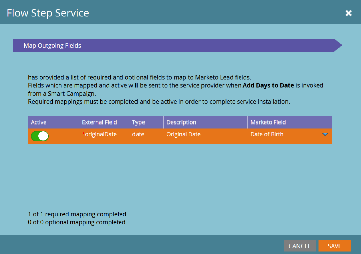

# Serviço de Etapa de Fluxo {#flow-step-service}

>[!NOTE]
>
>No momento, esse recurso de pré-lançamento está disponível apenas para contas inscritas no Programa Beta de Etapas de Fluxo de Autoatendimento.

Etapas de fluxo de autoatendimento é uma estrutura e um conjunto de recursos para criação, publicação e integração de serviços da Web em Campanhas inteligentes do Adobe Marketo Engage. Este guia destina-se aos usuários do Marketo Engage end que desejam instalar e usar serviços que já foram criados e publicados. Para obter informações sobre criação e publicação de seu próprio serviço, consulte o [Repositório GitHub para a interface do provedor de serviços](https://github.com/adobe/Marketo-SSFS-Service-Provider-Interface). Uma implementação da Tabela de pesquisa de prova de conceito pode ser encontrada [here](https://github.com/adobe/mkto-flow-lookup).

## Restrições e avisos de pré-lançamento {#pre-release-restrictions-and-warnings}

No momento, esse recurso está em beta fechado e tem algumas restrições de uso.

* Esse recurso só pode ser usado em instâncias de sandbox do Marketo Engage
* As etapas de Fluxo personalizado e de terceiros não são compatíveis com as Campanhas executáveis a partir da versão do quarto trimestre de 2021. Este montante deverá ser fixado no segundo trimestre de 2022
* A interface do usuário do Marketo Sky não deve ser usada em nenhuma instância com esse recurso ativado

## Integração e gerenciamento de serviços {#onboarding-and-managing-services}

A instalação de uma etapa de fluxo personalizada requer permissões de administrador no Marketo (**Gerenciar Webhooks** na versão de 21 de janeiro, alterada na versão de 11 de março). Além do URL de instalação, todos os outros aspectos de um serviço pode ser editados após a conclusão da integração inicial, fazendo o drill-down na tela de detalhes do serviço na grade Provedores de serviços.

## URL de instalação {#installation-url}

Para iniciar a instalação, primeiro você precisará obter o URL do documento OpenAPI que define seu serviço. Seu provedor de serviços deve ser capaz de fornecer isso a você e geralmente terá um URL terminando em `/openapi.json`. URLs completos terão algo semelhante a `https://www.example.com/OpenAPI.json`. Depois de ter esse URL, acesse o menu Provedores de serviços na Seção de administração.

Clique em **Próximo** para acessar a seção Inserir Credenciais de Serviço.

## Inserir Credenciais de Serviço {#enter-service-credentials}

Para acessar o serviço que está sendo instalado, o Marketo deve ter credenciais de API válidas. Essas credenciais devem ser fornecidas a você pelo seu provedor de serviços. Os serviços têm três opções de autenticação diferentes; portanto, você pode ver uma das três solicitações diferentes de credenciais: **Chave da API** que tem apenas um campo de entrada, **Autenticação básica** que requer um nome de usuário e senha e também pode exigir um campo chamado Realm, e **OAuth2** usando o _Credenciais do Cliente_ subvenção, que requer um _ID do cliente_ e _Segredo do cliente_.

>[!NOTE]
>
>O OAuth2 não estará disponível até a versão de 11 de março.

Ao salvar suas credenciais, a Marketo tentará chamar o endpoint de status do serviço para verificar se elas são válidas. Se as credenciais fornecidas forem inválidas, você verá um erro indicando isso.

## Guia de integração (opcional) {#onboarding-guide}

Alguns provedores de serviços incluirão uma etapa opcional do Guia de integração. Esta etapa incluirá todas as instruções adicionais para concluir a integração de serviço específicas a esse serviço.

## Mapeamento de campos {#field-mapping}

Para receber ou retornar dados de um campo de lead específico, esse campo deve ser mapeado. Embora o mapeamento seja uma etapa necessária durante a integração, você sempre pode retornar para alterar os mapeamentos posteriormente. Há dois tipos de mapeamentos configurados em telas separadas: **Campos de saída**, que são enviados para o serviço quando o Marketo chama a etapa de fluxo, e **Campos de entrada** que são campos que podem receber dados do serviço quando retorna dados para o Marketo.

>[!NOTE]
>
>Ao mapear um campo de saída, você concede à Marketo permissão para transmitir dados desse campo relacionados a leads que são processados pelo serviço associado. Certifique-se de ter a legitimidade e a autoridade apropriadas para transmitir esses dados ao seu provedor de serviços, pois esses campos podem incluir Informações de identificação pessoal cobertas pelas Leis de Privacidade de dados, Proteção e Localidade.

Os mapeamentos de campo opcionais podem ser desativados sem interrupção do serviço, mas os mapeamentos necessários não podem ser removidos ou desativados completamente.

## Mapeamentos orientados por serviços {#service-driven-mappings}

Os serviços que têm um conjunto fixo de entradas e saídas, como uma etapa de fluxo de registro de eventos, usam **Mapeamentos orientados por serviços**. Para esse tipo de mapeamento, o provedor de serviços fornecerá um tipo de dados e uma dica no formato de um nome de API. Se a dica corresponder ao nome da API de um campo de lead existente, esse campo será preenchido automaticamente na seção de mapeamento. Para campos sem uma dica correspondente, será necessário preencher o mapeamento manualmente da lista de campos com o tipo de dados correspondente. Os mapeamentos necessários devem ser preenchidos para concluir a integração.

## Mapeamentos orientados pelo usuário {#user-driven-mappings}

Os serviços que não têm um conjunto fixo de entradas e saídas, como um serviço de formatação de data, usam **Mapeamentos orientados pelo usuário**. Isso significa que cada campo de entrada e saída deve ser configurado por um Administrador.

## Campos de saída {#outgoing-fields}

Campos de saída são aqueles que são enviados para o Serviço de Etapa de Fluxo quando essa etapa de fluxo é usada em uma campanha inteligente.

## Campos de entrada {#incoming-fields}

Os campos de entrada são aqueles para os quais o Serviço de Etapa de Fluxo tem permissão para gravar dados.

## Opções de configuração (opcional) {#configuration-options}

Alguns serviços têm opções de configuração global opcionais ou obrigatórias. Se alguma opção for necessária, então um valor deve ser definido para todas as opções necessárias antes de salvar ou concluir a integração. Os parâmetros cujos nomes estão em itálico são enviados para o serviço chamado como cabeçalhos.

## Aposentar um Serviço {#retiring-a-service}

Para facilitar as transições para versões novas ou alternativas de um serviço, sem interromper o uso ativo, os serviços podem ser removidos do menu Provedores de serviços . **Aposentar um Serviço** remove a etapa de fluxo correspondente da paleta Fluxo de campanha inteligente, de modo que não é possível criar novos usos dela. Na maioria dos casos, você deve ter um serviço de substituição pronto para substituir o existente quando optar por desativar um serviço.

## Substituição de Serviço {#service-deprecation}

Às vezes, os provedores de serviços precisarão descontinuar os serviços de etapas de fluxo como parte normal do ciclo de vida do software. Quando um provedor de serviços anuncia isso, a Data de descontinuação e a Mensagem serão preenchidas na exibição de grade Provedores de serviços. Continuar a usar um serviço que foi descontinuado pode resultar em interrupção do serviço se ele não responder mais da maneira esperada ou parar de aceitar solicitações do Marketo Smart Campaigns, portanto, você deve prestar muita atenção a quaisquer notificações de descontinuação de serviço recebidas e tomar as medidas apropriadas para desativar ou substituir quaisquer etapas do serviço que ainda estejam em uso.

## Uso de etapas de fluxo personalizadas e de terceiros {#using-third-party-and-custom-flow-steps}

As etapas de fluxo instaladas podem ser usadas em grande parte da mesma maneira que as etapas de fluxo padrão. Todos os parâmetros de fluxo definidos pelo serviço são apresentados aos usuários finais.

## Atualizando Listas de Seleção {#refreshing-picklists}

A Marketo atualizará as opções da lista de opções para serviços todas as noites, mas há momentos em que você precisa de novas opções disponíveis, como a criação da campanha. Você pode atualizá-los facilmente de qualquer instância da sua etapa do fluxo usando o botão atualizar ou indo até o menu Admin > Provedores de serviço e clicando em Atualizar lista de opções depois de selecionar seu serviço.

## Verificando campos de entrada {#checking-incoming-fields}

Você pode verificar quais campos de entrada estão configurados para uma determinada etapa do fluxo ao passar o mouse sobre o ícone de dica de ferramenta. Isso é útil para determinar quais campos podem mudar quando um lead flui por meio dele, de modo que você possa configurar opções em etapas subsequentes usando esses campos.

## Campos de entrada e alterações no valor de dados {#incoming-fields-and-data-value-changes}

Ao contrário da maioria das outras etapas de fluxo, as implementadas com a estrutura do SSFS podem gravar dados de volta em campos de lead que são mapeados por um administrador e registrar essas alterações como atividades de Alteração de valor de dados.  Quando uma etapa do fluxo grava dados dessa maneira, todas essas alterações serão concluídas antes que a Campanha inteligente passe para qualquer etapa subsequente, para que todos os dados gravados sejam confiáveis nas opções subsequentes da etapa do fluxo.

## Logs de serviço e estatísticas {#service-logs-and-statistics}

Cada Serviço de Etapa de Fluxo tem vários tipos de registro associados a ele para ajudar a monitorar a integridade e solucionar problemas relacionados à integração.

## Estatísticas do Serviço {#service-statistics}

O log de estatísticas do serviço agrega os resultados de invocações e retornos de chamada para cada serviço. Eles são agrupados por tempo, nível (pedaço ou registro) e código, e fornecem contagens e a mensagem de log mais recente para cada código recebido. Este painel foi projetado principalmente para auxiliar no monitoramento da saúde do serviço.
