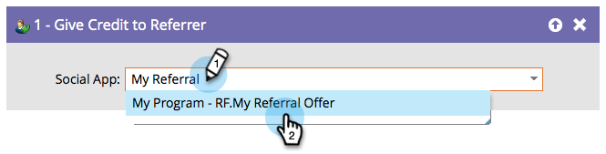

# Conceder crédito ao responsável pela indicação {#give-credit-to-referrer}

Ao executar uma _oferta de referência_ ou um _sorteio_, você pode dar crédito ao referenciador usando métodos diferentes:

* Visitas indicadas
* Inscrições indicadas
* **Acionador da lista inteligente**
* Evento JavaScript personalizado

Se você optou por usar a opção **Acionador da Smart List** para especificar uma meta, será necessário usar a etapa de fluxo **[!UICONTROL Conceder Crédito ao Referenciador]**.

1. Depois de criar a campanha e decidir em qual ação acionar, localize e selecione o aplicativo social ao qual deseja conceder crédito.

   

   >[!NOTE]
   >
   >Verifique se o aplicativo social está configurado para usar o Acionador de lista inteligente. Consulte _Especificar Meta para Oferta de Referência_ para obter detalhes.

Excelente! Qualquer pessoa processada por essa etapa do fluxo agora dará crédito a seu referenciador.
