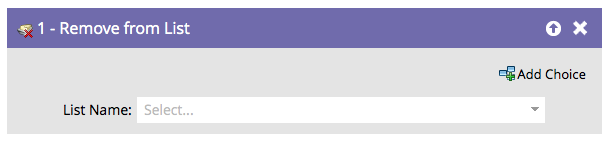

# Remover da lista {#remove-from-list}

Como você pode [Adicionar à Lista](/help/marketo/product-docs/core-marketo-concepts/smart-campaigns/flow-actions/add-to-list.md){target="_blank"}, também precisa de uma maneira de remover pessoas das listas.

1. Localize e selecione a lista da qual você deseja remover as pessoas.

   

Pronto!
