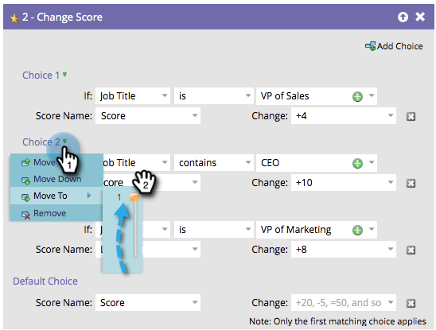

# Reordenar Adicionar Escolha em uma Etapa de Fluxo {#reorder-add-choice-in-a-flow-step}

Como apenas a primeira opção de correspondência se aplica a uma pessoa, a ordem é importante. Se você quiser alterar a ordem das condições definidas em uma etapa de fluxo, veja como.

1. Localize a etapa de fluxo para a qual você deseja alterar a ordem de uma escolha.

   

1. Neste exemplo, vamos mover a Opção 3 para acima da Opção 2. Clique em **[!UICONTROL Opção 3]** e clique em **[!UICONTROL Mover para cima]**.

   

   >[!NOTE]
   >
   >Ao reordenar, é possível **[!UICONTROL Mover para cima]**, **[!UICONTROL Mover para baixo]** ou **[!UICONTROL Mover para]**.

   Excelente! Agora você sabe como mover uma opção para cima/para baixo por incrementos únicos.

   

**ETAPA OPCIONAL**: Se você tiver muitas opções e precisar mover um múltiplo de níveis para cima ou para baixo, poderá usar esse método alternativo para economizar tempo. Clique na escolha que deseja mover e, em seguida, em **[!UICONTROL Mover para]**, arraste o controle deslizante até a posição para a qual deseja mover a escolha.

É fácil reorganizar a ordem de suas escolhas de degraus de fluxo.
