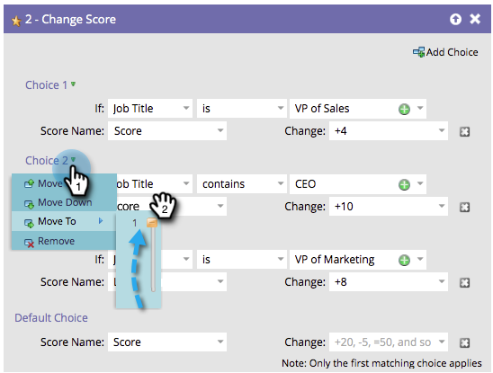

# Reordenar Adicionar Escolha em uma Etapa de Fluxo {#reorder-add-choice-in-a-flow-step}

Como apenas a primeira opção de correspondência se aplica a uma pessoa, a ordem é importante. Se você quiser alterar a ordem das condições definidas em uma etapa de fluxo, veja como.

1. Localize a etapa de fluxo para a qual você deseja alterar a ordem de uma escolha.

   

1. Neste exemplo, vamos mover a Opção 3 para acima da Opção 2. Clique na **[!UICONTROL Opção 3]** e em **[!UICONTROL Mover para Cima]**.

   

   >[!NOTE]
   >
   >Ao reordenar, você pode **[!UICONTROL Mover para Cima]**, **[!UICONTROL Mover para Baixo]** ou **[!UICONTROL Mover para Cima]**.

   Você pode mover uma opção para cima ou para baixo por incrementos únicos.

   

**ETAPA OPCIONAL**: se você tiver muitas opções e precisar mover vários níveis para cima ou para baixo, poderá usar esse método alternativo para economizar tempo. Clique na opção que deseja mover e, em **[!UICONTROL Mover para]**, arraste o controle deslizante para a posição para a qual deseja mover a opção.

