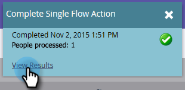

# Solicitar campanha {#request-campaign}

Você pode colocar pessoas em uma campanha específica usando o &quot;[!UICONTROL Solicitar campanha]&quot; etapa de fluxo único.

>[!NOTE]
>
>A campanha em que você está colocando a pessoa deve estar ativa e ter a [A campanha é solicitada](/help/marketo/product-docs/core-marketo-concepts/smart-campaigns/using-smart-campaigns/setting-up-a-trigger-smart-campaign-for-sales-using-campaign-is-requested.md){target="_blank"} acionador.

1. No **[!UICONTROL Banco de dados]**, localize e selecione a pessoa/pessoas desejadas.

   

1. Clique em **[!UICONTROL Ações da pessoa]**, passe o mouse sobre **[!UICONTROL Especial]** e selecione **[!UICONTROL Solicitar campanha]**.

   

1. Selecione a campanha em que você deseja colocar a pessoa e clique em **[!UICONTROL Executar agora]**.

   

1. No canto superior direito da tela, você verá quando a tarefa for concluída. Clique em **[!UICONTROL Exibir resultados]**.

   

   Sua pessoa está agora na campanha solicitada.

   

   Ótimo trabalho!

>[!TIP]
>
>Use o &quot;[!UICONTROL A campanha é solicitada]&quot;acione ou filtre para encontrar pessoas afetadas por essa etapa do fluxo.
