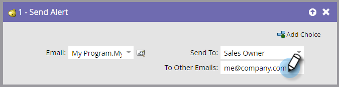

# Enviar alerta {#send-alert}

O Marketo Engage pode enviar um alerta por email com informações pessoais para qualquer pessoa: o proprietário das vendas, um parceiro ou outra pessoa. Use a etapa de fluxo &quot;[!UICONTROL Enviar Alerta]&quot;.

1. Localize e selecione o email que deseja enviar.

   

   >[!NOTE]
   >
   >Seu alerta de email deve conter todas as informações de cabeçalho e estar no estado **[!UICONTROL Aprovado]**.

1. Você pode clicar no ícone de visualização para garantir que selecionou o email correto.

   

   >[!NOTE]
   >
   >Certifique-se de usar o token &quot;[!UICONTROL Enviar Informações de Alerta]&quot; no seu email.

1. Selecione o destinatário do alerta. Você pode escolher [!UICONTROL Proprietário de vendas] ou [!UICONTROL Proprietário da conta].

   

1. Como opção, adicione outros endereços de email desejados (separados por vírgula ou ponto e vírgula).

   

   >[!TIP]
   >
   >Em campanhas de gatilho, você pode usar tokens em **[!UICONTROL Para Outros Emails]**, como `{{lead.Territory Owner}}` ou `{{my.Alert Recipient}}`, desde que os valores sejam endereços de email válidos. Os tokens em **[!UICONTROL Para outros emails]** não funcionarão em uma campanha em lote.

>[!MORELIKETHIS]
>
>[Criar um email](/help/marketo/product-docs/email-marketing/general/creating-an-email/create-an-email.md){target="_blank"}
