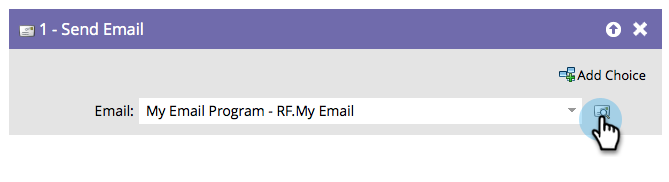

# Enviar e-mail {#send-email}

## Visão geral {#overview}

O &quot;[!UICONTROL Enviar e-mail]&quot;a etapa de fluxo pode ser usada como parte de campanhas ou como uma única etapa de fluxo para enviar emails para sua equipe.

## Uso {#usage}

Você pode visualizar o email selecionado diretamente da etapa de fluxo.

1. Localize e selecione o email que deseja enviar.

   

   >[!NOTE]
   >
   >Seu email deve ser aprovado se você quiser selecioná-lo na etapa de fluxo.

1. Clique no ícone de visualização para ver o email selecionado no momento.

   

Uma nova guia/janela será aberta, onde você poderá ver o email.
