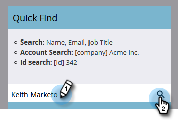

# Ações de Fluxo Único da Página de Detalhes da Pessoa {#single-flow-actions-from-person-detail-page}

Além de executar ações de fluxo único de dentro de uma Smart List, você também pode executá-las diretamente em uma página Detalhes da pessoa.

1. Clique em **Banco de Dados**.

   

1. Localize a pessoa desejada.

   

1. Clique no menu suspenso **Pessoa Actions** e selecione a etapa de fluxo de sua escolha. Neste exemplo, usaremos [Enviar email](/help/marketo/product-docs/core-marketo-concepts/smart-campaigns/flow-actions/send-email.md).

   

1. Selecione o email desejado e clique em **Executar agora**.

   

>[!NOTE]
>
>Se você navegar para uma página de Detalhes da pessoa diretamente (ou seja, por meio de um link) em vez de vir de uma página/ativo vinculado a um Workspace, será necessário escolher um Workspace na Etapa 4.
