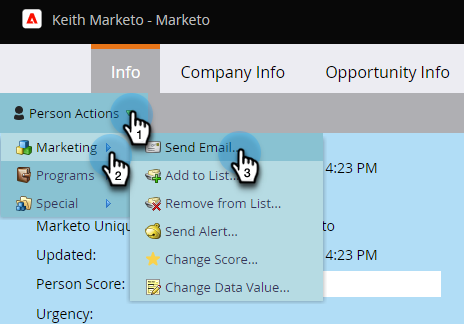

# Página Ações de Fluxo Único de Detalhes da Pessoa {#single-flow-actions-from-person-detail-page}

Além de executar ações de fluxo único de uma Smart List, você também pode executá-las diretamente em uma página Detalhes da pessoa.

1. Clique em **[!UICONTROL Banco de Dados]**.

   

1. Localize a pessoa desejada.

   

1. Clique no menu suspenso **[!UICONTROL Ações de pessoas]** e selecione a etapa de fluxo de sua escolha. Neste exemplo, usaremos [Enviar Email](/help/marketo/product-docs/core-marketo-concepts/smart-campaigns/flow-actions/send-email.md){target="_blank"}.

   

1. Selecione o email desejado e clique em **[!UICONTROL Executar Agora]**.

   

>[!NOTE]
>
>Se sua instância contiver Espaços de trabalho/Partições e você navegar diretamente para uma página Detalhes da pessoa (por exemplo, por meio de um link) em vez de vir de uma página/ativo vinculado a uma Workspace, também será necessário escolher uma Workspace na Etapa 4.
