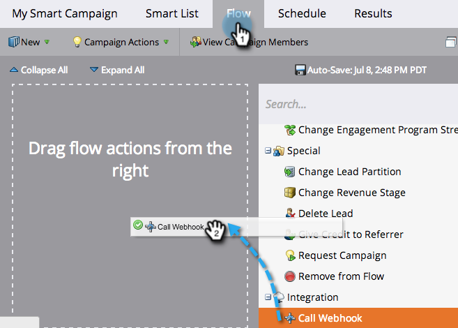

# Usar um webhook em uma campanha inteligente {#use-a-webhook-in-a-smart-campaign}

Para usar um [webhook](https://experienceleague.adobe.com/pt-br/docs/marketo-developer/marketo/webhooks/webhooks){target="_blank"}, adicione-o a uma [Campanha Inteligente](/help/marketo/product-docs/core-marketo-concepts/smart-campaigns/flow-actions/add-a-flow-step-to-a-smart-campaign.md){target="_blank"} como uma ação de fluxo.

>[!AVAILABILITY]
>
>Nem todos os usuários do Marketo Engage compraram essa funcionalidade. Entre em contato com a equipe de conta da Adobe (seu gerente de conta) para obter mais detalhes.

1. [Criar uma Campanha Inteligente](/help/marketo/product-docs/core-marketo-concepts/smart-campaigns/creating-a-smart-campaign/create-a-new-smart-campaign.md){target="_blank"}.

   >[!NOTE]
   >
   >Os webhooks só podem ser usados em Campanhas de acionador.

1. Vá para a guia **[!UICONTROL Fluxo]** e arraste a ação de fluxo **[!UICONTROL Chamar Webhook]**.

   

1. Selecione o **[!UICONTROL Webhook]**.

   

1. Também é possível usar Webhooks em uma Smart List.

   

1. Finalmente, você pode usar Webhooks em **[!UICONTROL Adicionar escolha]** em uma etapa de fluxo.

   
