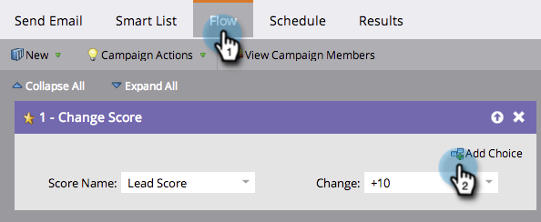
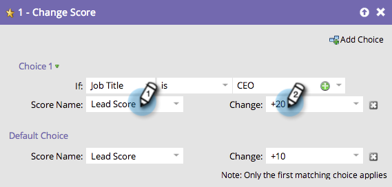

# Usar Adicionar escolha em uma etapa de fluxo {#use-add-choice-in-a-flow-step}

>[!PREREQUISITES]
>
>[Adicionar uma Etapa de Fluxo a uma Campanha Inteligente](/help/marketo/product-docs/core-marketo-concepts/smart-campaigns/flow-actions/add-a-flow-step-to-a-smart-campaign.md){target="_blank"}

&quot;Adicionar escolha&quot; permite usar uma etapa de fluxo e dizer &quot;depende&quot; ao escolher os detalhes.

1. Na guia **[!UICONTROL Fluxo]** do Smart Campaign, adicione qualquer etapa de fluxo e clique em **[!UICONTROL Adicionar opção]**.

   

1. Selecione a condição de escolha.

   

1. Escolha o operador e insira um valor de escolha. Isso define seus critérios ou sua escolha.

   

1. Informe um valor de etapa de fluxo para a escolha.

   

   >[!CAUTION]
   >
   >Os tokens _não_ funcionarão na parte de condição de uma etapa de fluxo de escolha.

1. Repita as etapas acima para adicionar várias opções e, em seguida, adicione/ajuste o valor padrão.

   

   >[!TIP]
   >
   >Você pode definir qualquer uma de suas etapas de fluxo como —Não fazer nada—, nesse caso, nenhuma ação será tomada sobre essa escolha.

   >[!CAUTION]
   >
   >Somente a primeira opção correspondente é aplicada à etapa do fluxo. Saiba como [reordenar &quot;Adicionar opção&quot; em uma ação de fluxo](/help/marketo/product-docs/core-marketo-concepts/smart-campaigns/flow-actions/reorder-add-choice-in-a-flow-step.md){target="_blank"}.

   Ótimo! Agora você pode criar uma única Campanha inteligente com opções de etapa de fluxo em vez de criar várias Campanhas inteligentes para cada escolha.

   >[!MORELIKETHIS]
   >
   >[Reordenar Adicionar Opção em uma Etapa de Fluxo](/help/marketo/product-docs/core-marketo-concepts/smart-campaigns/flow-actions/reorder-add-choice-in-a-flow-step.md){target="_blank"}
