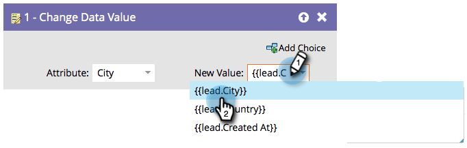

# Usar tokens em etapas de fluxo {#use-tokens-in-flow-steps}

>[!PREREQUISITES]
>
>[Adicionar uma etapa de fluxo a uma campanha inteligente](/help/marketo/product-docs/core-marketo-concepts/smart-campaigns/flow-actions/add-a-flow-step-to-a-smart-campaign.md){target="_blank"}

Um token é uma variável. Você o usa em emails, Landing Pages e Campanhas inteligentes para facilitar sua vida. Você pode usar [Meus tokens](/help/marketo/product-docs/core-marketo-concepts/programs/tokens/understanding-my-tokens-in-a-program.md){target="_blank"} (tokens personalizados) em etapas de fluxo, webhooks, emails e landing pages. Você pode usar tokens para incluir conteúdo variável nestas etapas de fluxo:

* Alterar valor dos dados
* Alterar dados dos membros do programa
* Momento interessante
* Etapas da campanha do Salesforce (adicionar, remover, alterar status)
* Criar tarefa
* Enviar alerta (somente em Campanhas de acionamento)

1. Na etapa de fluxo, comece a digitar `{{` para obter categorias de token.

   

   >[!NOTE]
   >
   >Confira [Visão geral de tokens](/help/marketo/product-docs/demand-generation/landing-pages/personalizing-landing-pages/tokens-overview.md){target="_blank"} para obter uma lista de vários tokens disponíveis.

1. Continue a digitar até encontrar o token que deseja e clique para selecionar.

   

   >[!TIP]
   >
   >Vários tokens podem ser usados nas etapas de fluxo Momento interessante, Criar tarefa e Enviar alerta.

   >[!NOTE]
   >
   >Os tokens de campo personalizado do membro do programa podem ser usados em: Criar tarefa, Criar tarefa no Microsoft, Momentos interessantes, Ações de fluxo Alterar valor de dados e Webhooks.

   Legal! Os dados serão extraídos do token quando a Campanha inteligente for executada.

   >[!MORELIKETHIS]
   >
   >* [Gerenciamento de meus tokens](/help/marketo/product-docs/core-marketo-concepts/programs/tokens/managing-my-tokens.md){target="_blank"}
   >* [Compreender meus tokens em um programa](/help/marketo/product-docs/core-marketo-concepts/programs/tokens/understanding-my-tokens-in-a-program.md){target="_blank"}
