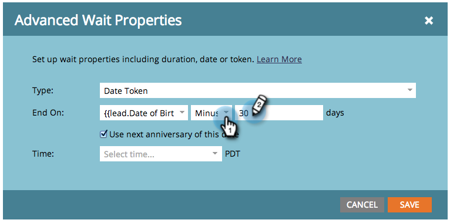

# Usar um token de data em uma etapa de fluxo de espera {#use-a-date-token-in-a-wait-flow-step}

Você pode usar a etapa Fluxo de espera para pausar a jornada de uma pessoa em uma Campanha inteligente até uma data específica que use um token de data. Você também pode modificar a data de término por algum número de dias.

>[!NOTE]
>
>Isso se aplica somente a Campanhas de acionador. Não é possível usar esse recurso em campanhas em lote.

1. Em sua campanha inteligente **[!UICONTROL Fluxo]** arraste sobre a guia **[!UICONTROL Aguardar]** etapa do fluxo.

   

1. Clique no ícone de engrenagem.

   

1. No **[!UICONTROL Tipo]** selecione **[!UICONTROL Token de data]**.

   

1. Escolha um token de Data para especificar quando a etapa de Espera deve terminar:

   * `{{my._____}}`
   * `{{lead.______}}`
   * `{{company.______}}`
   * `{{system._______}}`

   

1. Para aguardar até o próximo aniversário da data que ocorrer no ano atual ou no próximo ano, marque a caixa.

   

   >[!TIP]
   >
   >Use essa opção em tokens de data que se referem a datas no passado, como uma data de aniversário ou de início de contrato.

1. Como opção, você pode modificar a data final em um número especificado de dias.

   

   >[!NOTE]
   >
   >Você também pode especificar o número de dias usando uma `{{lead.` ou `{{company.` token que representa um campo inteiro ou um `{{my.` token do tipo de número.

1. Clique em **[!UICONTROL Salvar]**.

   

   >[!MORELIKETHIS]
   >
   >* [Usar uma duração em uma etapa de fluxo de espera](/help/marketo/product-docs/core-marketo-concepts/smart-campaigns/flow-actions/wait/use-a-duration-in-a-wait-flow-step.md){target="_blank"}
   >* [Usar uma Data Específica em uma Etapa de Fluxo de Espera](/help/marketo/product-docs/core-marketo-concepts/smart-campaigns/flow-actions/wait/use-a-specific-date-in-a-wait-flow-step.md){target="_blank"}
