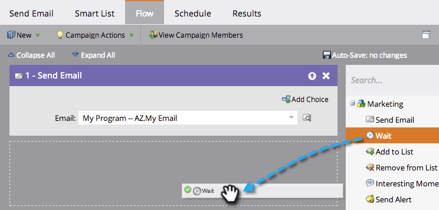
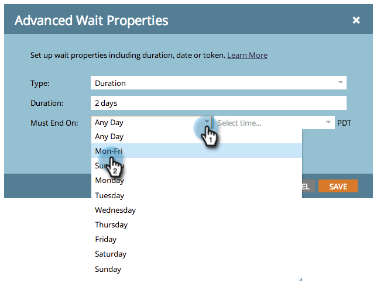

# Usar uma Duração em uma Etapa de Fluxo de Espera {#use-a-duration-in-a-wait-flow-step}

Você pode usar a etapa de fluxo de espera para pausar a jornada de uma pessoa através de uma campanha inteligente por um certo período de tempo. Você também pode especificar critérios para o dia da semana e a hora em que ela termina.

1. Na guia **Fluxo** da campanha inteligente, arraste sobre a etapa de fluxo **Aguarde**.

   

1. Digite quanto tempo deseja pausar.

   

1. É isso! O fluxo será pausado pela duração especificada. Para opções avançadas, clique no ícone de engrenagem à direita.

   

1. Especifique o dia da semana em que a etapa de espera deve terminar.

   

1. Como opção, especifique a hora. Clique em **Salvar**.

   

   >[!NOTE]
   >
   >**Exemplo**
   >
   >
   >Uma pessoa dispara uma campanha inteligente na sexta-feira às 17h. A etapa de espera está avançada: 48 horas e deve terminar de manhã às 9h00.
   >
   >
   >O resultado seria que a pessoa continuaria no fluxo em **segunda-feira, 9h**. Esta é a primeira data M-F após 48 horas.

   >[!NOTE]
   >
   >A duração, as datas, os horários e os dias usados são todos baseados no fuso horário de sua subscrição.

   >[!NOTE]
   >
   >**Artigos relacionados**
   >
   >    
   >    
   >    * [Usar uma data específica em uma etapa de fluxo de espera](use-a-specific-date-in-a-wait-flow-step.md)
   >    * [Usar um token de data em uma etapa de fluxo de espera](use-a-date-token-in-a-wait-flow-step.md)

