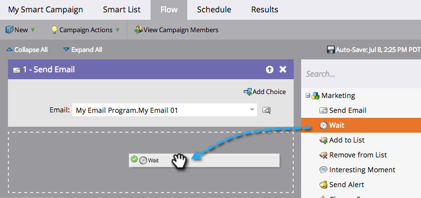

# Usar uma data específica em uma etapa de espera do fluxo {#use-a-specific-date-in-a-wait-flow-step}

Você pode usar a etapa de fluxo &quot;[!UICONTROL Aguardar]&quot; para pausar a jornada de uma pessoa em uma Campanha Inteligente até uma data específica.

1. Na guia **[!UICONTROL Fluxo]** do Smart Campaign, arraste sobre a etapa de fluxo **[!UICONTROL Aguardar]**.

   

1. Clique no ícone de engrenagem.

   

1. No menu suspenso **[!UICONTROL Tipo]**, selecione **[!UICONTROL Data]**.

   

1. Selecione a data específica quando deseja retomar.

   

1. Especifique a hora (opcional) e clique em **[!UICONTROL Salvar]**.

   

>[!MORELIKETHIS]
>
>* [Usar uma Duração em uma Etapa de Fluxo de Espera](/help/marketo/product-docs/core-marketo-concepts/smart-campaigns/flow-actions/wait/use-a-duration-in-a-wait-flow-step.md){target="_blank"}
>* [Usar um token de data em uma etapa de fluxo de espera](/help/marketo/product-docs/core-marketo-concepts/smart-campaigns/flow-actions/wait/use-a-date-token-in-a-wait-flow-step.md){target="_blank"}
