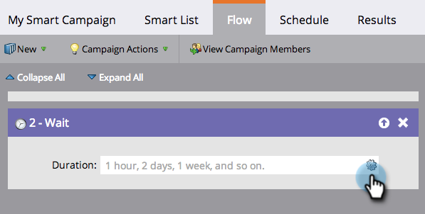

# Usar uma Data Específica em uma Etapa de Fluxo de Espera {#use-a-specific-date-in-a-wait-flow-step}

Você pode usar o &quot;[!UICONTROL Aguardar]&quot; etapa de fluxo para pausar a jornada de uma pessoa em uma Campanha inteligente até uma data específica.

1. Em sua campanha inteligente **[!UICONTROL Fluxo]** arraste sobre a guia **[!UICONTROL Aguardar]** etapa do fluxo.

   

1. Clique no ícone de engrenagem.

   

1. No **[!UICONTROL Tipo]** selecione **[!UICONTROL Data]**.

   

1. Selecione a data específica quando deseja retomar.

   

1. Especifique a hora (opcional) e clique em **[!UICONTROL Salvar]**.

   

>[!MORELIKETHIS]
>
>* [Usar uma duração em uma etapa de fluxo de espera](/help/marketo/product-docs/core-marketo-concepts/smart-campaigns/flow-actions/wait/use-a-duration-in-a-wait-flow-step.md){target="_blank"}
>* [Usar um token de data em uma etapa de fluxo de espera](/help/marketo/product-docs/core-marketo-concepts/smart-campaigns/flow-actions/wait/use-a-date-token-in-a-wait-flow-step.md){target="_blank"}
