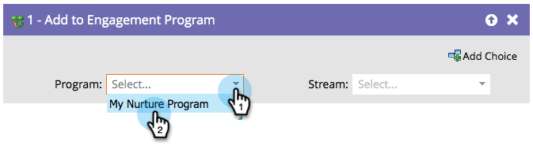

# Adicionar ao programa de engajamento {#add-to-engagement-program}

A Campanha inteligente que você criar com essa etapa de fluxo será o gateway para o seu programa de engajamento.

1. Selecione o programa de envolvimento ao qual deseja adicionar as pessoas.

   

1. Selecione o fluxo no qual você deseja colocar as pessoas.

   

   >[!NOTE]
   >
   >Não é possível adicionar uma pessoa a vários fluxos no mesmo programa.
