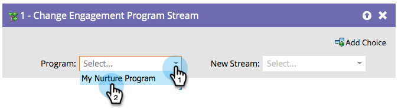

# Alterar fluxo do programa de envolvimento {#change-engagement-program-stream}

Normalmente, você usaria [regras de transição de fluxo](/help/marketo/product-docs/email-marketing/drip-nurturing/engagement-program-streams/transition-people-between-engagement-streams.md) para fazer isso. Mas se você quiser mover pessoas manualmente de um fluxo para outro, esta é a etapa do fluxo a ser usada.

1. Selecione o programa de envolvimento para o qual você deseja mover a pessoa.

   >[!NOTE]
   >
   >Se você selecionar um programa diferente, ele deixará a pessoa em seu fluxo atual, bem como a adicionará ao novo.

   

1. Selecione o fluxo ao qual você deseja adicionar suas pessoas.

   

E é isso!
