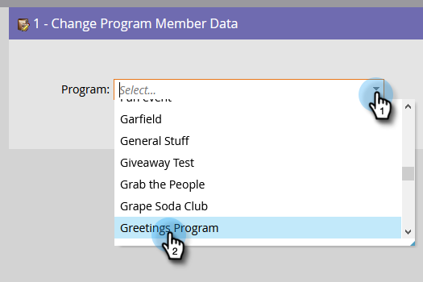

# Alterar dados de membros do programa {#change-program-member-data}

Você pode usar o Marketo para atualizar o valor de um campo utilizando a ação de fluxo Alterar valor dos dados.

>[!NOTE]
>
>Também é possível bloquear a atualização de um campo. Consulte Bloquear atualizações de um campo para obter detalhes.

1. Na guia Fluxo do Smart Campaign, traga a **[!UICONTROL etapa de fluxo Alterar dados do membro do programa]** e escolha o programa desejado.

   

1. Localize e selecione o atributo do qual deseja alterar o valor.

   

1. Informe o valor do Atributo desejado.

   

>[!NOTE]
>
>Você também pode usar tokens em [!UICONTROL Novo valor].

Execute a Campanha inteligente quando estiver pronto.

>[!TIP]
>
>Se quiser limpar os campos, em vez de atualizá-los, você poderá inserir &quot;NULL&quot; (sem aspas, todas em maiúsculas) como o [!UICONTROL Novo valor].

>[!MORELIKETHIS]
>
>* [Usar tokens em etapas de fluxo](/help/marketo/product-docs/core-marketo-concepts/smart-campaigns/flow-actions/use-tokens-in-flow-steps.md){target="_blank"}
>* [Anexar Dados a um Campo](/help/marketo/product-docs/core-marketo-concepts/smart-campaigns/flow-actions/append-data-to-a-field.md){target="_blank"}
