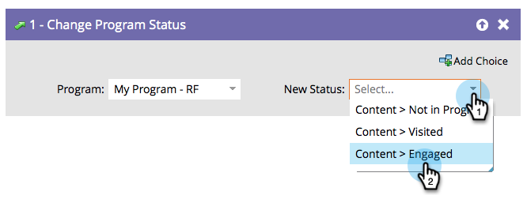

# Alterar status do programa {#change-program-status}

## Visão geral {#overview}

Os status do programa ajudam você a acompanhar o progresso das pessoas em um programa ou evento. Encontre mais informações em [Personalizar, Criar E Gerenciar Canais](/help/marketo/product-docs/administration/tags/create-a-program-channel.md){target="_blank"}.

>[!CAUTION]
>
>Alterar o status do programa em um programa de envolvimento os adicionará automaticamente ao primeiro fluxo. Eles começarão a receber conteúdo.

## Uso {#usage}

1. Arraste no **[!UICONTROL Alterar status do programa]** etapa do fluxo.

   

1. Selecione o **[!UICONTROL Novo Status]** que deseja definir. A pessoa também se tornará membro do programa se ainda não o foi.

   

As opções são limitadas aos status válidos para esse programa.

>[!NOTE]
>
>Uma pessoa não consegue voltar para um status anterior do programa, conforme definido no Editor de canais em Admin.

Os status são ferramentas eficientes para monitorar pessoas e gerar relatórios.
