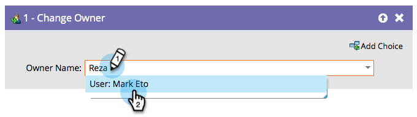

# Alterar proprietário {#change-owner}

Se você tiver pessoas existentes que já estejam atribuídas a um proprietário, poderá usar essa etapa do fluxo para reatribuí-las a outro proprietário.

1. Basta escolher o proprietário ou a fila de clientes potenciais para a qual deseja mudar e ir embora!

   

   >[!CAUTION]
   >
   >O Salesforce não permite que contatos sejam atribuídos a filas de clientes potenciais. Para um registro que seja um contato SFDC:
   >
   >* O Marketo criará um cliente em potencial duplicado **only** quando o contato for sincronizado com o Salesforce. Em outras palavras, se você usar a etapa de fluxo **[Sincronizar pessoa com SFDC](/help/marketo/product-docs/core-marketo-concepts/smart-campaigns/salesforce-flow-actions/sync-person-to-sfdc.md)** com `AssignTo=<a lead queue>`, o Marketo criará um cliente potencial duplicado no Salesforce e o atribuirá à fila de clientes potenciais.
   >
   >* Se você usar a etapa de fluxo **[!UICONTROL Alterar proprietário]** em um contato, a Marketo criará um cliente potencial duplicado no Salesforce. Para evitar isso, use um filtro no campo &quot;Tipo SFDC&quot; que limite a ação somente a clientes potenciais.

   >[!NOTE]
   >
   >Se o registro ainda não existir em sua conta do Salesforce, nós o sincronizaremos e o atribuiremos ao usuário selecionado.
