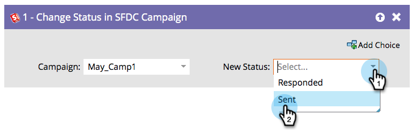

# Alterar status de campanha do SFDC {#change-status-in-sfdc-campaign}

Essa etapa do fluxo permite alterar o status dos membros do Salesforce campaign dos leads.

>[!NOTE]
>
>Disponível somente quando integrado com [!DNL Salesforce].

Se um cliente potencial ainda não existir no Salesforce ou não for membro da campanha, ele será sincronizado automaticamente e adicionado à campanha do Salesforce com o status apropriado.

1. Primeiro, localize e selecione a **[!UICONTROL Campanha]** da Salesforce em que o registro está.

   

1. Em seguida, selecione o **[!UICONTROL Novo Status]** que deseja definir e pronto!

   
