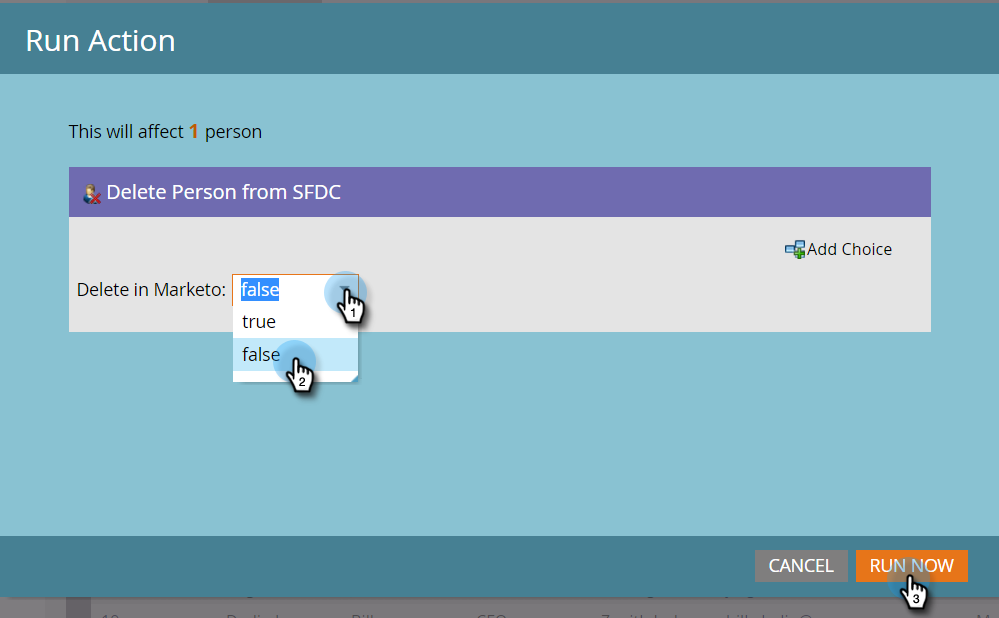

# Excluir Pessoa do SFDC {#delete-person-from-sfdc}

Se você precisar remover um conjunto específico de clientes potenciais do Salesforce, mas deixá-los como pessoas no Marketo, poderá usar a ação Excluir pessoa do fluxo SFDC.

>[!NOTE]
>
>**FYI**
>
>O Marketo agora está padronizando o idioma em todas as subscrições, portanto você pode ver o lead/lead na sua subscrição e a pessoa/pessoas em docs.marketo.com. Estes termos significam a mesma coisa. isso não afeta as instruções do artigo. Há outras mudanças também. [Saiba mais](http://docs.marketo.com/display/DOCS/Updates+to+Marketo+Terminology).

>[!NOTE]
>
>Disponível somente quando integrado ao Salesforce.

1. No Banco de Dados, clique na pessoa que deseja remover do Salesforce. Em seguida, clique em Ações **da** pessoa e selecione **Salesforce**.

   

1. Selecione **Excluir pessoa do SFDC**.

   

1. Verifique se a configuração **Excluir no Marketo** é **falsa** e clique em **Executar agora**.

   

   Depois que a etapa de fluxo for executada, sua pessoa não será mais líder no Salesforce, mas permanecerá no Marketo.

   >[!CAUTION]
   >
   >Se você definir **Excluir no Marketo** para **verdadeiro** e excluir as pessoas do Marketo e as informações do Salesforce, elas desaparecerão para sempre. Isto não pode ser desfeito.

