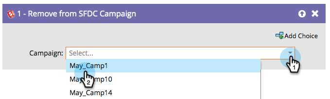

# Remover da campanha do SFDC {#remove-from-sfdc-campaign}

Da mesma forma que você pode [Adicionar ao SFDC Campaign](/help/marketo/product-docs/core-marketo-concepts/smart-campaigns/salesforce-flow-actions/add-to-sfdc-campaign.md){target="_blank"} e [Alterar Status no SFDC Campaign](/help/marketo/product-docs/core-marketo-concepts/smart-campaigns/salesforce-flow-actions/change-status-in-sfdc-campaign.md){target="_blank"}, também é possível remover pessoas ou clientes potenciais de uma campanha do Salesforce.

>[!NOTE]
>
>Disponível somente quando integrado com [!DNL Salesforce].

1. Depois de arrastar para a etapa de fluxo, localize e selecione a campanha do Salesforce da qual deseja remover a pessoa ou lead.

   

   >[!TIP]
   >
   >Se a pessoa ou o cliente em potencial não for um membro da campanha selecionada, eles serão ignorados.

Quando as pessoas ou os clientes potenciais continuarem, eles serão removidos da campanha [!DNL Salesforce] que você escolheu.
