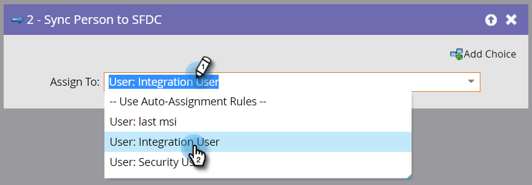

# Sincronizar pessoa ao SFDC {#sync-person-to-sfdc}

Esta etapa de fluxo inserirá as pessoas criadas pela Marketo como clientes potenciais no Salesforce CRM.

>[!NOTE]
>
>Disponível somente quando integrado com [!DNL Salesforce].

1. Por padrão, essa etapa do fluxo atribuirá aos proprietários de clientes potenciais com base nas regras de atribuição automática do Salesforce.

   

   >[!TIP]
   >
   >[!DNL Salesforce] exige que a pessoa tenha os campos Empresa e Sobrenome preenchidos. Caso contrário, ele rejeitará o registro de lead.

1. Você pode definir um usuário [!DNL Salesforce] específico ou uma fila de clientes potenciais como o proprietário principal.

   

   Ao usar essa etapa do fluxo, a pessoa é sincronizada como um cliente em potencial [!DNL Salesforce] imediatamente e não precisa aguardar a sincronização normal.

   >[!CAUTION]
   >
   >[!DNL Salesforce] não permite que &quot;Contatos&quot; sejam atribuídos a filas de clientes potenciais. Nesse caso, a Marketo criará um &quot;Lead&quot; duplicado em [!DNL Salesforce].
