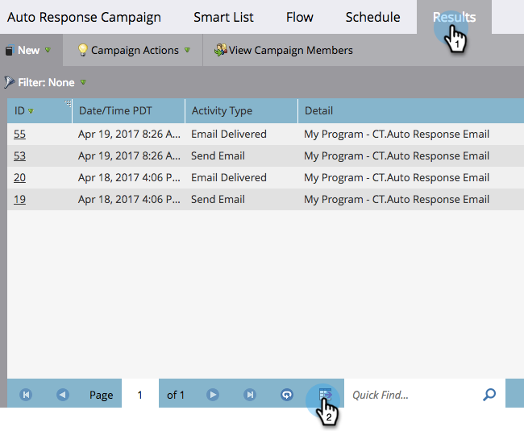

# Exportar resultados da campanha inteligente para [!DNL Excel] {#export-smart-campaign-results-to-excel}

Exporte os resultados da Campanha inteligente para o Excel para uso fora do Marketo Engage.

1. Na Campanha inteligente, clique na guia **[!UICONTROL Resultados]** e, em seguida, no ícone de exportação na parte inferior.

   

   Seus resultados foram exportados e estão prontos para uso.

   >[!NOTE]
   >
   >A exportação é limitada a 20.000 linhas. O arquivo [!DNL Excel] é salvo na pasta de downloads padrão do seu navegador.
