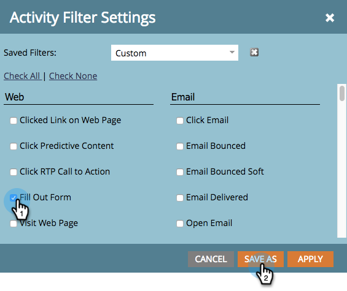

# Filtrar resultados de campanha inteligente {#filter-smart-campaign-results}

>[!PREREQUISITES]
>
>[Exibir resultados do Smart Campaign](/help/marketo/product-docs/core-marketo-concepts/smart-campaigns/smart-campaign-data/view-smart-campaign-results.md)

Filtre os resultados da Campanha inteligente para ver atividades específicas importantes para você.

## Filtrar por filtros salvos {#filter-by-saved-filters}

1. Na guia **[!UICONTROL Resultados]** da Campanha Inteligente, clique em **[!UICONTROL Filtro]** e selecione um filtro salvo.

   

   >[!NOTE]
   >
   >Por padrão, não há filtros aplicados e os resultados mostram todas as atividades.

## Criar um filtro personalizado {#create-a-custom-filter}

1. Clique em **[!UICONTROL Filtro]** e depois em **[!UICONTROL Personalizado]**.

   

1. Selecione os tipos de atividades que deseja ver e clique em **[!UICONTROL Salvar como]**.

   

   >[!TIP]
   >
   >Clique em **[!UICONTROL Aplicar]** para aplicar diretamente um filtro personalizado aos seus resultados sem salvá-lo.

1. Insira um nome de filtro e clique em **[!UICONTROL Salvar]**.

   

1. O filtro personalizado será aplicado aos seus resultados e agora está disponível na lista suspensa (talvez seja necessário atualizar a página para vê-la na lista suspensa).

   
