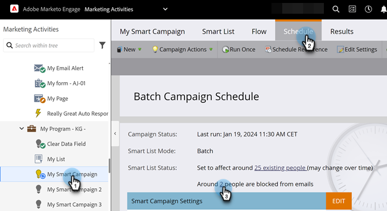

# Exibir pessoas bloqueadas em uma campanha inteligente {#view-blocked-people-in-a-smart-campaign}

As pessoas bloqueadas no banco de dados do Marketo Engage incluir na lista de bloqueios são marcadas como, canceladas, com suspensão de marketing e/ou têm um email inválido ou vazio.

1. Na Campanha inteligente, clique em **[!UICONTROL Agendar]**. Em **[!UICONTROL Status da Smart List]**, clique no segundo link.

   

   >[!NOTE]
   >
   >As pessoas que atingiram seus limites de comunicação também podem ser impedidas de receber emails. Saiba como [editar limites de comunicação](/help/marketo/product-docs/administration/email-setup/enable-communication-limits.md){target="_blank"} na seção de Administrador.

   A guia **[!UICONTROL Clientes Potenciais Bloqueados]** mostra pessoas que talvez não recebam correspondências.

   

   >[!NOTE]
   >
   >Emails operacionais serão enviados às pessoas marcadas como não inscritas e com marketing suspenso.

   >[!MORELIKETHIS]
   >
   >* [Editar Regras de Qualificação](/help/marketo/product-docs/core-marketo-concepts/smart-campaigns/using-smart-campaigns/edit-qualification-rules-in-a-smart-campaign.md){target="_blank"}
   >* [Habilitar Limites de Comunicação](/help/marketo/product-docs/administration/email-setup/enable-communication-limits.md){target="_blank"}
   >* [Exibir membros do Smart Campaign](/help/marketo/product-docs/core-marketo-concepts/smart-campaigns/smart-campaign-data/view-smart-campaign-members.md){target="_blank"}
   >* [Exibir Pessoas Qualificadas em uma Campanha Inteligente](/help/marketo/product-docs/core-marketo-concepts/smart-campaigns/smart-campaign-data/view-qualified-people-in-a-smart-campaign.md){target="_blank"}
