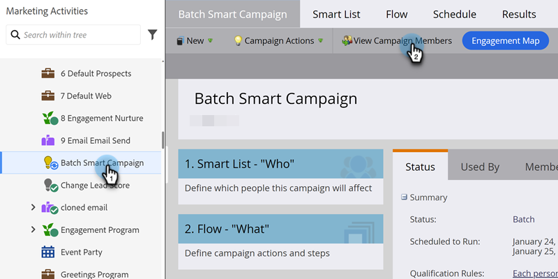

# Exibir membros do Smart Campaign {#view-smart-campaign-members}

Exibir pessoas que já passaram pelo fluxo do Smart Campaign.

1. Vá para **[!UICONTROL Atividades de marketing]**.

   

1. Na Campanha inteligente, clique em **[!UICONTROL Exibir membros da campanha]**.

   

   >[!TIP]
   >
   >Você pode exibir os membros da campanha de qualquer lugar em uma Campanha inteligente.

1. A guia **[!UICONTROL Membros da campanha]** mostra pessoas que já passaram pelo fluxo da Campanha Inteligente.

   

   >[!NOTE]
   >
   >A lista de Membros da campanha estará inicialmente vazia quando a Campanha inteligente não for executada em nenhuma pessoa.

   >[!MORELIKETHIS]
   >
   >[Exibir Pessoas Bloqueadas em uma Campanha Inteligente](/help/marketo/product-docs/core-marketo-concepts/smart-campaigns/smart-campaign-data/view-blocked-people-in-a-smart-campaign.md){target="_blank"}
